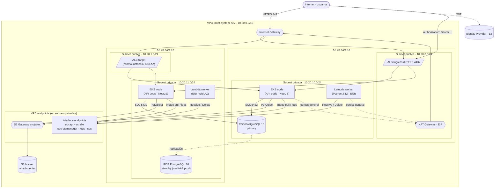

# Sistema de Tickets e Incidentes — Entrega 3: Red
**Universidad Galileo · Postgrado en Diseño y Desarrollo de Software · Infraestructura en la Nube**
**Ciclo Mayo–Junio 2026**

**Equipo:**
- Luis André Morales
- Erick Estuardo Saban

---

## [Entrega 3 - Red]
- [x] Resumen de cambios desde E2
- [x] Diagrama de contexto (heredado)
- [x] Diagrama de contenedores (v1)
- [x] Decisión de cómputo (heredada)
- [x] Modelo de datos (heredado)
- [x] Diseño de red
- [x] Preguntas abiertas
- [x] Anexo IA

---

## Resumen de cambios desde E2

E3 itera sobre el documento de E2 agregando la **capa de red** y la primera versión del **diagrama de contenedores**. Las decisiones de cómputo (EKS + Lambda) y de datos (RDS PostgreSQL + S3) se mantienen idénticas: la red se construye encima sin renegociar lo ya decidido.

### Cambio 1 — Cierre de las 4 preguntas abiertas de Red planteadas en E2

E2 dejó marcadas cuatro decisiones de red como pendientes. Al implementar el módulo `infra/modules/network/` en el curso paralelo de Automatización con IaC (PRs #6 y #7, BL-107 a BL-110), las cuatro se cerraron con valores concretos. E3 las documenta formalmente:

| Pregunta abierta en E2 | Decisión en E3 |
|---|---|
| ¿Cuál será el CIDR de la VPC dedicada? | `10.20.0.0/16` (RFC1918, sin colisión con default VPC `172.31.0.0/16`) |
| ¿Cuántas Availability Zones — 2 o 3? | **2 AZs** (`us-east-1a`, `us-east-1b`) — mínimo requerido por RDS multi-AZ y EKS. Justificación en §5.2 |
| ¿NAT Gateway o VPC endpoints? | **Híbrido**: 1 NAT Gateway + 5 VPC endpoints (1 gateway S3 + 4 interface). Trade-off en §5.4 |
| ¿En qué subnet viven los pods de EKS? | **Subnets privadas**, con ALB Ingress en subnets públicas. No NodePort público. Justificación en §5.5 |

### Cambio 2 — Aparece el diagrama de contenedores (v1)

E2 incluía únicamente el diagrama de contexto (C4 nivel 1). En E3 aparece por primera vez el **diagrama de contenedores** (C4 nivel 2) con la separación pública/privada y los bloques principales del sistema (compute, BD, storage) ubicados en sus subnets correspondientes. Se completará en E4 con queues/topics. Ver §2.

### Cambio 3 — Ajuste menor al diagrama de contexto

El diagrama de contexto heredado de E2 no cambia su contenido, pero se reinterpreta en §1: ahora se entiende explícitamente que el límite de confianza del sistema es la VPC dedicada que se diseña en esta entrega, y que los actores externos cruzan ese límite vía HTTPS sobre el ALB público.

### Sin cambios

- Decisión de cómputo (EKS para API + Lambda para worker async): sin cambios respecto a E2 §2.
- Modelo de datos (`tickets`, `ticket_events`, `sla_rules`, `users` en RDS + adjuntos en S3): sin cambios respecto a E2 §3.
- Decisión de caché (rechazada): sin cambios respecto a E2 §3.4.

---

## 1. Diagrama de contexto

El diagrama muestra el sistema como una caja negra (nivel C4-1). Se distinguen tres categorías: actores primarios que interactúan directamente, sistemas externos aún por decidir, y servicios cloud propios ya definidos. En E3, el límite de confianza del sistema corresponde a la VPC dedicada `10.20.0.0/16` que se diseña en §5; los actores cruzan ese límite vía HTTPS sobre el ALB público.


**Actores primarios** (color púrpura en el diagrama): Reportante, Agente / SRE, Administrador. Los tres interactúan con el sistema vía API REST sobre HTTPS.

**Sistemas externos por definir:**
- **Identity Provider:** provee el JWT con el rol del usuario. La tecnología concreta (Cognito, Auth0, Keycloak) se decide en E5 — Seguridad.
- **Servicio de notificaciones:** recibe eventos del sistema y los entrega por email y/o Slack. El canal concreto se decide en E4 — Asíncrono.

**Servicios cloud propios** (ya decididos):
- **Amazon S3:** almacena adjuntos de tickets. Bucket con versioning, SSE-S3 y lifecycle en `attachments/`.
- **Amazon RDS PostgreSQL 16:** almacena tickets, historial de eventos y reglas de SLA.

---

## 2. Diagrama de contenedores (v1)

El diagrama de contenedores (C4 nivel 2) muestra los bloques principales del sistema ubicados en su subnet correspondiente dentro de la VPC dedicada. Las queues/topics asíncronos no aparecen aún — se agregarán en E4.



**Cómo leer el diagrama:**
- El borde de la VPC es el límite de confianza del sistema. Todo lo que entra cruza por el IGW; nada de lo privado tiene IP pública.
- El **ALB** vive en las subnets públicas y termina TLS. Sus targets son los **pods de EKS** en las subnets privadas (una réplica por AZ como mínimo).
- **RDS** y **Lambda** viven exclusivamente en subnets privadas. RDS muestra `primary/standby` por AZ; multi-AZ se activa en `prod` (`db_multi_az = true` en `infra/envs/prod/prod.tfvars`).
- El tráfico hacia AWS (S3, ECR pulls, CloudWatch Logs, Secrets Manager, SQS) **no pasa por el NAT**: usa **VPC endpoints**. El S3 endpoint es gateway (gratis); los demás son interface (~$7/mes c/u, justificados en §5.4).
- El **NAT Gateway** queda como fallback para cualquier egress general (DNS público, telemetría externa, paquetes del SO en los nodos EKS). Es único, en `us-east-1a` — trade-off explícito de costo vs HA en §5.2.

---

## 3. Decisión de cómputo

*(Heredado de E2 sin cambios. Reproducido aquí para que E3 sea autocontenido.)*

### Contexto
El sistema tiene dos cargas de trabajo con perfiles completamente distintos:

| Carga | Patrón | Característica clave |
|---|---|---|
| **API REST** | Síncrona · baja latencia | Recibe `POST /tickets`, `PATCH`, `GET`. El usuario espera respuesta inmediata. |
| **Worker asíncrono** | Event-driven · tolerante a latencia | Procesa eventos de SQS: envía notificaciones y evalúa SLA vencidos. |

### 3.1 API REST → EKS
La API REST corre en un cluster EKS con managed node group. Justificación: experiencia previa del equipo con Kubernetes, control granular sobre el modelo de red de los pods, alineación con el módulo `eks` del curso de Automatización, y rolling updates sin downtime. Trade-off aceptado: $0.10/h de control plane (~$73/mes base) vs ECS Fargate o Lambda síncrona.

### 3.2 Worker asíncrono → AWS Lambda
El worker corre como función AWS Lambda (Python 3.12, 128 MB, 30s timeout, dentro de la VPC). Justificación: el worker es event-driven por naturaleza, evita redundancia de planos de contenedores frente a EKS, IAM role mínimo sin wildcards, y costo ~$0 dentro del free tier. Trade-off aceptado: cold start 1–5s en VPC, aceptable para escalamiento de SLA y notificaciones.

### 3.3 Resumen
```
Capa pública     →  EKS (API REST · pods replicados)
Capa asíncrona   →  Lambda (worker SQS · event-driven)
Almacenamiento   →  RDS PostgreSQL 16 + S3
```

---

## 4. Modelo de datos

*(Heredado de E2 sin cambios. Resumen ejecutivo; el detalle de columnas, tipos e índices vive en E2 §3.)*

### 4.1 Separación BD vs almacenamiento de objetos
SQL-queryable (filtros, JOINs, rangos) → RDS PostgreSQL. Binario de tamaño variable que solo se lee/descarga → S3 (`attachments/`).

### 4.2 Tablas
- **`tickets`** — entidad central. Columnas clave: `id UUID PK`, `number TEXT UNIQUE` (`TKT-NNNN`), `type`, `severity`, `priority`, `state`, `escalation_level`, `reporter_id`, `assignee_id`, `sla_rule_id`, `sla_due_at`, `resolved_at`, timestamps. Índices: `(state, priority, created_at)`, `(reporter_id, state)`, `(assignee_id, state)`, `(sla_due_at)`.
- **`ticket_events`** — historial inmutable. `(ticket_id, created_at)` para historial cronológico.
- **`sla_rules`** — configuración del admin: `response_minutes` y `escalation_levels JSONB`.
- **`users`** — perfil interno; el rol del JWT manda en autorización.

### 4.3 Decisión de caché
**No se incluye caché.** El volumen del sistema (50–200 ingenieros, ~200 tickets concurrentes) no justifica ElastiCache. Los índices son suficientes para queries <100ms. Si crece a miles de tickets activos, se reevalúa.

---

## 5. Diseño de red

Esta sección documenta el módulo `infra/modules/network/` ya implementado (BL-107..110, mergeado en PRs #6 y #7). Cada decisión se justifica con criterios y trade-offs explícitos.

### 5.1 VPC y CIDR

**Decisión:** una sola VPC dedicada con CIDR primario **`10.20.0.0/16`** (65 536 IPs).

**Justificación:**
1. **Rango RFC1918 sin colisión.** La default VPC de AWS usa `172.31.0.0/16`. Elegir `10.20.0.0/16` evita conflictos si en el futuro se hace peering hacia ambientes que ya tienen recursos en la default VPC.
2. **`10.x.x.x` deja espacio para crecimiento horizontal.** Si en una iteración futura se agrega una segunda VPC (por ejemplo, para un servicio de observabilidad separado), bastan rangos contiguos `10.21.0.0/16`, `10.22.0.0/16` sin renumerar.
3. **El offset `20` evita los rangos comunes `10.0.0.0/16` y `10.1.0.0/16`.** En entornos compartidos esos dos rangos suelen estar tomados por VPCs heredadas o por sandboxes individuales. Empezar en `10.20` reduce la probabilidad de colisión sin pedir permiso a nadie.

**Alternativas descartadas:**
- `10.0.0.0/16` — alta probabilidad de colisión con VPCs heredadas en cuentas compartidas.
- `192.168.0.0/16` — rango típico de redes domésticas; conviene reservarlo para conectividad de oficina/VPN si se llega a necesitar.

**Implementación:** `infra/modules/network/variables.tf:18`.

### 5.2 Availability Zones

**Decisión:** **2 AZs** — `us-east-1a` y `us-east-1b`.

**Justificación:**
1. **Mínimo requerido.** RDS multi-AZ requiere ≥2 AZs para el subnet group. EKS también exige ≥2 AZs para colocar nodos del managed node group. 1 AZ no es opción.
2. **Costo de la tercera AZ no se justifica para el sistema.** Una tercera AZ implica duplicar (a) subnets, (b) NAT Gateway si se quiere HA por AZ, (c) interface endpoints (se cobran por AZ), y (d) ENIs de Lambda y nodos EKS. Para una empresa de 50–200 ingenieros con ~200 tickets concurrentes, la disponibilidad ofrecida por 2 AZs (99.99% SLA documentado por AWS) es suficiente.
3. **La validación en el módulo es ≥2, no =2.** El módulo permite escalar a 3 AZs cambiando `availability_zones` en el `.tfvars` sin tocar el código del módulo. La decisión es de configuración, no de arquitectura.

**Trade-off explícito 2 vs 3 AZs:**

| Aspecto | 2 AZs (elegido) | 3 AZs |
|---|---|---|
| Subnets totales | 4 (2 pub + 2 priv) | 6 (3 pub + 3 priv) |
| Costo NAT (HA per-AZ) | ~$33/mes (single AZ) o ~$66/mes (2-AZ HA) | ~$99/mes (3-AZ HA) |
| Costo interface endpoints | 5 × $7 × 2 AZ = $70/mes | 5 × $7 × 3 AZ = $105/mes |
| Disponibilidad efectiva | 99.99% (suficiente) | 99.999% (sobreingeniería para este sistema) |
| Spread RDS / EKS | Estándar | Estándar |

**Validación en código:** `infra/modules/network/variables.tf:32` rechaza configuraciones con <2 AZs.

### 5.3 Subnets

**Layout:** 1 subnet pública + 1 subnet privada **por AZ**, todas `/24` (256 IPs cada una).

| AZ | Tier | CIDR | Recursos | Tags k8s |
|---|---|---|---|---|
| us-east-1a | Pública | `10.20.0.0/24` | ALB target, NAT Gateway | `kubernetes.io/role/elb=1` |
| us-east-1b | Pública | `10.20.1.0/24` | ALB target | `kubernetes.io/role/elb=1` |
| us-east-1a | Privada | `10.20.10.0/24` | EKS node, RDS primary, Lambda ENI, interface endpoints | `kubernetes.io/role/internal-elb=1` |
| us-east-1b | Privada | `10.20.11.0/24` | EKS node, RDS standby (prod), Lambda ENI, interface endpoints | `kubernetes.io/role/internal-elb=1` |

**Detalles de diseño:**

- **`/24` por subnet (256 IPs).** Suficiente para 200 pods + EKS overhead + ENIs de Lambda + 2 RDS endpoints + 5 interface endpoints × 2 AZ. Los pods de EKS con VPC CNI consumen una IP por pod desde la subnet del nodo, así que `/24` da margen para crecer ~10× antes de tener que repensar el layout.
- **Offset de `+10` entre tier público y tier privado.** Los CIDRs privados son `10.20.10.0/24` y `10.20.11.0/24` (no `10.20.2.0/24`). El offset deja headroom para agregar un **tercer tier** (por ejemplo, `database-only` con `10.20.20.0/24`) sin renumerar.
- **`map_public_ip_on_launch = true`** solo en las públicas. Las privadas no asignan IP pública en ninguna circunstancia.
- **Tags de Kubernetes en ambas tiers.** El AWS Load Balancer Controller descubre subnets por tags: `kubernetes.io/role/elb=1` para internet-facing y `kubernetes.io/role/internal-elb=1` para internal ALBs (preparado por si en E4/E5 se agregan servicios internos).
- **Tag opcional `kubernetes.io/cluster/<name>=shared`** controlado por `var.cluster_name`. Defaults a `""` (deshabilitado) para mantener el módulo independiente del cluster específico.

**Implementación:** `infra/modules/network/vpc.tf:5-94` y locals en `main.tf:29-51`.

### 5.4 Conectividad saliente — NAT vs VPC endpoints

**Decisión:** **híbrido** — 1 NAT Gateway + 5 VPC endpoints en paralelo.

#### Trade-off explícito

| Estrategia | Costo fijo | Costo variable | Cobertura | Riesgo |
|---|---|---|---|---|
| Solo NAT | ~$33/mes (single AZ) | $0.045 por GB procesado | Cubre **toda** salida | NAT es el cuello de botella; los ECR pulls grandes y los logs cuestan caro en GB-egress |
| Solo VPC endpoints | ~$70/mes (5 endpoints × 2 AZ × $7) | $0.01 por GB | Cubre **solo AWS** (S3, ECR, Logs, Secrets, SQS); deja sin egress el DNS público, telemetría a terceros, paquetes del SO | Cualquier servicio externo no-AWS queda sin acceso |
| **Híbrido (elegido)** | **~$68/mes** (NAT $33 + endpoints $35) | **Mínimo** (lo gordo va por endpoints) | **Total** — endpoints absorben tráfico AWS, NAT cubre el resto | Ninguno relevante |

#### Justificación

1. **El tráfico AWS de alta frecuencia tiene un endpoint.** Los pulls de ECR durante un rolling update mueven ~80 MB por nodo; los logs de CloudWatch se generan en cada request. Pasar ese tráfico por NAT cuesta egress variable y consume capacidad. Los endpoints lo absorben sin egress NAT.
2. **El NAT cubre lo demás.** DNS externo (`*.npmjs.org`, `*.docker.io` durante builds), telemetría a servicios SaaS que el sistema podría usar en E5 (por ejemplo, un IdP externo), o cualquier dependencia transitoria. Renunciar al NAT obligaría a permitir todo eso vía endpoints específicos — operativamente pesado y frágil.
3. **El S3 endpoint es gratis (gateway type).** Cualquier `PutObject` o `GetObject` desde los pods o desde Lambda va por la tabla de rutas privada sin tocar el NAT. Esto es importante porque los adjuntos de tickets son la mayor fuente de bytes en el sistema.
4. **NAT single-AZ es trade-off de costo aceptado.** Un NAT por AZ duplica el costo a ~$66/mes solo en NAT. En el contexto del curso académico, una falla de AZ-a (que no vamos a simular) tiene baja probabilidad y baja consecuencia. El módulo deja documentado en `gateways.tf:1-15` cómo cambiar `count = 1` por `count = local.az_count` cuando el sistema se profesionalice. La promoción a producción reusa el módulo cambiando una variable, no un patrón.

#### Endpoints concretos provisionados (5)

| Tipo | Servicio | Por qué |
|---|---|---|
| Gateway | `s3` | Adjuntos de tickets; el flujo de mayor volumen en bytes. Gratis. |
| Interface | `ecr.api` | Llamadas de control plane de ECR (catálogo, tokens). |
| Interface | `ecr.dkr` | Pulls de capas de imagen Docker durante rolling updates. |
| Interface | `secretsmanager` | Credenciales de RDS y futuras del Slack webhook (E4) / IdP (E5). |
| Interface | `logs` | PutLogEvents desde los pods EKS y desde Lambda. |
| Interface | `sqs` | Receive / Delete / SendMessage del worker Lambda (E4). |

**Security group compartido:** los 4 interface endpoints comparten un SG (`<prefix>-vpce-sg`) con ingress TCP 443 únicamente desde el CIDR de la VPC (`aws_vpc.cidr_block`). Egress fully open por default (los endpoints no inician conexiones). Implementación: `infra/modules/network/endpoints.tf:45-63`.

#### Endpoints que NO se provisionaron (y por qué)

| Servicio | Razón de descarte |
|---|---|
| `kms` | E5 — Seguridad. Se decidirá junto con la rotación de credenciales y la elección de Secrets Manager vs Parameter Store. |
| `sts` | No es necesario hasta que haya IRSA (IAM Roles for Service Accounts) activo en EKS, lo cual entra en E5. |
| `ssm` | Se agrega solo si se decide gestionar parámetros con Parameter Store en lugar de Secrets Manager. Pendiente E5. |
| `events` (EventBridge) | Pendiente de la decisión E4 sobre el mecanismo de scheduling del job de escalamiento (SQS event source vs EventBridge Scheduler). |

Provisionarlos prematuramente cuesta $7 × 2 AZ × mes c/u sin uso real.

### 5.5 Exposición de los pods de EKS

**Decisión:** los pods de EKS viven en **subnets privadas**; la única ruta desde Internet es el **ALB Ingress en subnets públicas**.

**Justificación:**
1. **Defensa en profundidad.** Un pod expuesto vía NodePort público depende del SG del nodo como única capa de control. Con ALB Ingress hay dos capas: el ALB (target group con health checks, WAF en el futuro) y el SG de los nodos (ingress solo desde el SG del ALB).
2. **TLS termina en el ALB.** El ALB recibe HTTPS 443 y reenvía HTTP al target group dentro de la VPC. Esto centraliza el manejo de certificados (ACM) y libera a los pods de manejar TLS.
3. **Tags listos.** Las subnets públicas tienen `kubernetes.io/role/elb=1` y las privadas tienen `kubernetes.io/role/internal-elb=1`. El AWS Load Balancer Controller crea ALBs internet-facing en las primeras y ALBs internos en las segundas sin configuración adicional.
4. **Routing privado tiene salida via NAT.** Cuando un pod necesita egress externo (`npm install` durante un build, o llamada al IdP en E5), el default route de la subnet privada apunta al NAT. Cubierto sin abrir las subnets de los nodos al Internet entrante.

**Alternativa descartada — NodePort público:** habría requerido subnets públicas para los nodos, IPs públicas en cada nodo, y reglas de SG manuales por puerto. Operativamente más frágil y con peor postura de seguridad. La rúbrica del curso premia explícitamente la separación pública/privada.

**Lo que falta agregar en E4 (BL-111, BL-112, BL-113):**
- `AWS Load Balancer Controller` instalado vía Helm en el cluster.
- `Ingress` Kubernetes con anotaciones para ALB internet-facing.
- ACM certificate + redirect HTTP → HTTPS.
- Security Groups por capa: `alb-sg` (443 desde Internet), `nodes-sg` (ingress solo desde `alb-sg`), `db-sg` (5432 solo desde `nodes-sg` y `lambda-sg`), `lambda-sg` (sin ingress, egress al VPC CIDR).

Esos items están scoped en `docs/backlog.md` épica EP-09 y caen en D4/D5.

### 5.6 Costo mensual estimado de la capa de red

| Componente | Cantidad | Costo unitario | Subtotal |
|---|---|---|---|
| VPC, subnets, route tables, IGW | 1 set | $0 | **$0** |
| EIP (asociada al NAT) | 1 | $0 (asociada) | **$0** |
| NAT Gateway (single-AZ) | 1 | ~$33/mes + $0.045/GB | **~$33/mes** + egress |
| S3 Gateway endpoint | 1 | $0 | **$0** |
| Interface endpoints (ecr.api, ecr.dkr, secretsmanager, logs, sqs) | 5 servicios × 2 AZs = 10 ENIs | ~$0.01/h × 730h = $7.30/ENI/mes | **~$73/mes** |
| | | **Total fijo** | **~$106/mes** |

**Nota:** el cálculo de interface endpoints en la sección 5.4 (≈$35/mes) usaba $7 × 5 servicios. La cifra correcta multiplicando por AZ es ≈$73/mes (5 servicios × 2 AZs × $7.30). La diferencia (~$38/mes) es el costo de redundancia de los endpoints en ambas AZs, requerido para que un pod en `us-east-1b` no dependa del endpoint en `us-east-1a`.

**Ahorro vs no usar endpoints:** los pulls de ECR durante un rolling update de los pods de la API consumen ~80 MB × 2 nodos = 160 MB. Si eso pasara por NAT a $0.045/GB serían fracciones de centavo por update, pero los logs de CloudWatch en operación normal acumulan GBs/mes. El break-even del endpoint de `logs` está alrededor de ~150 GB/mes de logs egresando, alcanzable en operación normal del sistema.

### 5.7 Cómo se conecta esto con los módulos downstream

| Módulo | Consume | Output usado |
|---|---|---|
| `module.database` (RDS) | `private_subnet_ids` para el DB subnet group | `module.network.private_subnet_ids` |
| `module.compute` (Lambda) | `private_subnet_ids` y SG para ENI | `module.network.private_subnet_ids` |
| `module.eks` | `private_subnet_ids` (nodos), `public_subnet_ids` (ALB) | ambos outputs |
| SGs futuros (BL-113) | `vpc_id` para crear SGs por capa | `module.network.vpc_id` |
| Allow-lists externas | `nat_eip` para que servicios externos puedan whitelist nuestro egress | `module.network.nat_eip` |

Outputs declarados en `infra/modules/network/outputs.tf:6-39`.

---

## 6. Preguntas abiertas

E3 cierra las 4 preguntas de Red que E2 dejó marcadas. Las preguntas de E4 (Asíncrono), E5 (Seguridad) y Observabilidad se mantienen abiertas según el cronograma del curso.

**Cerradas en E3:**
- ✅ Q-NET-1 — CIDR de la VPC. **Cerrada:** `10.20.0.0/16` (§5.1).
- ✅ Q-NET-2 — Número de AZs. **Cerrada:** 2 AZs `us-east-1a` + `us-east-1b` (§5.2).
- ✅ Q-NET-3 — NAT vs VPC endpoints. **Cerrada:** híbrido — 1 NAT + 5 endpoints (§5.4).
- ✅ Q-NET-4 — Exposición de pods EKS. **Cerrada:** subnets privadas con ALB Ingress en públicas (§5.5).

**Nuevas preguntas que aparecen en E3:**
- ¿Activamos **VPC Flow Logs** desde el día 1 o en una iteración posterior? Trade-off: $0.50/GB ingestado a CloudWatch vs visibilidad para auditoría. Probable cierre en E5 — Seguridad / Observabilidad.
- ¿En qué momento promovemos el **NAT single-AZ a NAT per-AZ**? Costo extra ~$33/mes por la segunda NAT. Sin urgencia mientras estemos en ciclo académico.

**Para E4 — Asíncrono (heredadas de E2 sin cambios):**
- ¿El canal de notificaciones será SES (email) + Slack webhook, o solo email en una primera versión?
- ¿El worker de evaluación de SLA corre como event source de SQS o como Lambda con EventBridge Scheduler?
- ¿Qué pasa si el worker de SLA falla a mitad de un ciclo de evaluación? ¿Idempotencia por `ticket_id`?
- ¿Cuál es el threshold de reintentos antes de enviar a DLQ un mensaje de notificación fallido?

**Para E5 — Seguridad (heredadas de E2 sin cambios):**
- ¿Qué Identity Provider concreto maneja la autenticación — Cognito, Auth0, o un IdP corporativo?
- ¿Los secretos de RDS (password) y del Slack webhook se gestionan con Secrets Manager o Parameter Store?
- ¿Hay rotación automática de credenciales de RDS desde el primer día o se agrega en una iteración posterior?
- ¿Activamos `kms`, `sts`, `ssm` como interface endpoints en E5? (Diferido en §5.4.)

---

## 7. Anexo IA

### Qué le pedimos a la IA en E3
- Comparación cuantitativa **NAT-only vs endpoints-only vs híbrido** con tabla de costos en `us-east-1`.
- Validación del esquema de CIDRs (`10.20.0.0/16` con offset `+10` entre tiers público y privado).
- Borrador del diagrama Mermaid de contenedores con la separación pública/privada.
- Revisión de consistencia entre el documento E3 y el código real en `infra/modules/network/`.
- Sugerencia de qué VPC endpoints provisionar en E3 y cuáles diferir a E5.

### Qué aceptamos y editamos
- **La tabla de costos de §5.4 y §5.6 fue generada por IA y editada con los precios reales de `us-east-1`** ($7.30/ENI/mes para interface endpoints, $33/mes para NAT, $0.045/GB de egress NAT). La cifra inicial subestimaba el costo de endpoints porque no multiplicaba por AZ; el equipo lo corrigió y agregó la nota explícita en §5.6 explicando la discrepancia entre las dos tablas.
- **El diagrama Mermaid de §2 fue iterado tres veces.** La primera versión mostraba ALB en cada AZ como dos balancers separados — incorrecto, el ALB es un solo recurso con targets en múltiples AZs. La segunda versión metía las queues SQS, pero la rúbrica dice explícitamente que las queues entran en E4. La tercera versión (la publicada) las omite y deja la nota.
- **La lista de interface endpoints fue recortada de 9 a 5.** La IA propuso provisionar `kms`, `sts`, `ssm` y `events` adicionales "por consistencia". El equipo los descartó porque no hay uso concreto en E3 — diferir esos endpoints a E5 ahorra ~$53/mes (4 × $7.30 × 2 AZ ≈ $58/mes) sin perder funcionalidad evaluable en esta entrega.
- **El trade-off de 2 vs 3 AZs (§5.2) fue sugerido por IA** como "2 AZs por costo". El equipo agregó la justificación cuantitativa concreta (multiplicación de subnets, NAT, endpoints, costos por línea) y la validación en el código (`variables.tf:32`) que permite escalar sin cambio de arquitectura.

### Qué descartamos y por qué
- **VPC con 3 AZs.** La IA inicialmente la recomendó como "best practice de HA". El equipo lo descartó porque la mejora de disponibilidad (99.99% → 99.999%) no se mide en este sistema y el costo es ~50% mayor en NAT + endpoints. La decisión queda documentada y reversible (cambiar `availability_zones` en el `.tfvars`).
- **PrivateLink hacia servicios fuera de AWS.** La IA sugirió usar PrivateLink para "integraciones con SaaS". Descartado: ningún SaaS está definido como dependencia del sistema en E1; sería diseñar para un futuro hipotético.
- **Transit Gateway.** La IA lo mencionó como "para multi-VPC y multi-cuenta". Descartado: el sistema tiene una sola VPC y una sola cuenta AWS. Transit Gateway tiene costo fijo ~$36/mes + por GB que no se justifica.
- **NAT Gateway en cada AZ desde el día 1.** La IA lo propuso para HA. Descartado en favor del trade-off explícito documentado en §5.4 y en `gateways.tf:1-15`: el módulo está preparado para escalar a per-AZ cambiando `count = 1` por `count = local.az_count`, pero la decisión de hoy es single-AZ por costo.
- **Subnet dedicada solo para BD (`database`).** La IA propuso un tercer tier para aislar RDS. Descartado en E3: con 2 tiers (pub/priv) y SGs por capa (BL-113, en E4) la segmentación es suficiente. El módulo deja headroom con el offset `+10` para agregar ese tier sin renumerar si en E5 la rúbrica lo exige.
