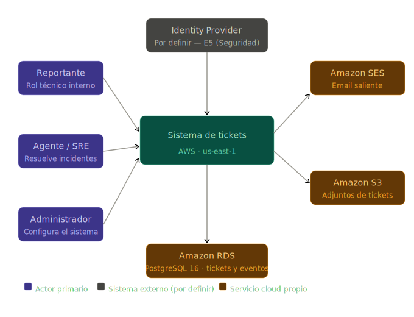

# Sistema de Tickets e Incidentes — Entrega 4: Procesamiento Asíncrono
**Universidad Galileo · Postgrado en Diseño y Desarrollo de Software · Infraestructura en la Nube**
**Ciclo Mayo–Junio 2026**

**Equipo:**
- Luis André Morales
- Erick Estuardo Saban

---

## [Entrega 4 — Procesamiento Asíncrono]
- [x] Resumen de cambios desde E3
- [x] Diagrama de contexto (actualizado)
- [x] Diagrama de contenedores (v2 — con queues/topics)
- [x] Decisión de cómputo (heredada)
- [x] Modelo de datos (heredado)
- [x] Diseño de red (heredado)
- [x] Flujos asíncronos
- [x] Preguntas abiertas
- [x] Anexo IA

---

## Resumen de cambios desde E3

E4 agrega la **capa asíncrona** sobre la red, el cómputo y los datos ya diseñados. Las decisiones anteriores no se renegocian — se construye encima. Lo que esta entrega cierra son las cuatro preguntas que quedaron abiertas desde E2 y confirmadas en E3.

### Cambio 1 — Canal de notificaciones: Amazon SES (email)

E3 dejaba abierto si las notificaciones irían por SES, Slack webhook, o ambos. La decisión es **solo Amazon SES** en esta fase. Razón: SES es un servicio AWS nativo sin dependencias externas — no hay webhook de terceros, no hay token externo que rotar, y el tráfico de control ya estaba cubierto por el VPC endpoint de `secretsmanager` provisionado en E3. Slack se deja documentado como extensión futura pero fuera del scope de E4.

Impacto en el diagrama de contexto: el nodo "Servicio de notificaciones (por definir)" de E3 se reemplaza por **Amazon SES** con canal definido.

### Cambio 2 — Evaluador de SLA: EventBridge Scheduler + Lambda

E3 dejaba abierto si el evaluador de SLA vencidos correría como consumer de una cola SQS o como Lambda schedulada. La decisión es **EventBridge Scheduler disparando la Lambda worker cada 5 minutos**. Razón: el evaluador es un proceso periódico que consulta la BD — no reacciona a un evento externo. EventBridge Scheduler es el primitivo correcto para eso; una cola SQS requeriría un productor externo que la alimente a intervalos, añadiendo complejidad sin beneficio.

Nota sobre infraestructura: E3 difirió el endpoint `events` (EventBridge) porque la decisión de scheduling estaba abierta. Con esta decisión confirmada, el endpoint `com.amazonaws.us-east-1.events` se agrega en E4 para que Lambda pueda recibir invocaciones de EventBridge sin pasar por el NAT.

### Cambio 3 — El endpoint SQS de E3 ya cubre el flujo de notificaciones

El endpoint `com.amazonaws.us-east-1.sqs` fue provisionado en E3 como parte del conjunto de 5 interface endpoints (`infra/modules/network/endpoints.tf`). El worker Lambda ya puede hacer `SendMessage`, `ReceiveMessage` y `DeleteMessage` sin tocar el NAT. No se requiere ningún cambio de red para E4.

### Cambio 4 — Lambda pasa de placeholder a diseño completo

El `index.py` actual termina con el comentario *"In Delivery 4 this function will be wired as the event source consumer for an SQS queue"*. E4 documenta la lógica completa del worker — los dos flujos que ejecutará, el payload que procesará, y cómo maneja fallos. El código real se implementa en D4 del curso de Automatización.

### Sin cambios

- Decisión de cómputo (EKS para API + Lambda para worker): sin cambios.
- Modelo de datos (4 tablas en RDS + adjuntos en S3): sin cambios.
- Diseño de red (VPC `10.20.0.0/16`, 2 AZs, híbrido NAT + 5 endpoints): sin cambios — solo se agrega el endpoint de EventBridge.

---

## 1. Diagrama de contexto

El diagrama de contexto (C4 nivel 1) se actualiza en un punto respecto a E3: el nodo "Servicio de notificaciones (por definir)" se reemplaza por **Amazon SES**. El Identity Provider sigue pendiente para E5.



**Cambio respecto a E3:**
- **Amazon SES** reemplaza "Servicio de notificaciones (por definir)". Canal: email. Los actores que reciben notificaciones son Reportante, Agente/SRE y Administrador según el tipo de evento.

**Sin cambios:**
- **Identity Provider:** tecnología concreta (Cognito, Auth0, Keycloak) se decide en E5.
- **Amazon S3:** adjuntos de tickets. Sin cambios.
- **Amazon RDS PostgreSQL 16:** datos del sistema. Sin cambios.

---

## 2. Diagrama de contenedores (v2 — con queues y workers)

El diagrama de E3 (v1) mostraba compute, BD y storage en sus subnets. E4 agrega la cola SQS, su DLQ y el EventBridge Scheduler. La red y el cómputo no cambian.

```mermaid
flowchart TB
    Internet([Internet · usuarios])
    IdP[(Identity Provider · E5)]
    SES([Amazon SES\nemail saliente])

    subgraph VPC["VPC ticket-system-dev · 10.20.0.0/16"]
        IGW{{Internet Gateway}}

        subgraph AZA["AZ us-east-1a"]
            subgraph PubA["Subnet pública · 10.20.0.0/24"]
                ALB[/"ALB Ingress (HTTPS 443)"/]
                NAT{{NAT Gateway · EIP}}
            end
            subgraph PrivA["Subnet privada · 10.20.10.0/24"]
                EKSnodeA["EKS node\n(API pods · NestJS)"]
                LambdaA["Lambda worker\n(Python 3.12 · ENI)"]
                RDSp[("RDS PostgreSQL 16\nprimary")]
            end
        end

        subgraph AZB["AZ us-east-1b"]
            subgraph PubB["Subnet pública · 10.20.1.0/24"]
                ALBb[/"ALB target\n(mismo recurso, otro AZ)"/]
            end
            subgraph PrivB["Subnet privada · 10.20.11.0/24"]
                EKSnodeB["EKS node\n(API pods · NestJS)"]
                LambdaB["Lambda worker\n(ENI multi-AZ)"]
                RDSs[("RDS PostgreSQL 16\nstandby (prod)")]
            end
        end

        subgraph Async["Capa asíncrona · servicios regionales AWS"]
            SQSnotif[["SQS Standard\nticket-notifications"]]
            SQSdlq[["SQS DLQ\nticket-notifications-dlq"]]
            EB{{EventBridge Scheduler\ncron rate(5 minutes)}}
        end

        subgraph Endpoints["VPC endpoints"]
            EPs3{{"S3 Gateway endpoint"}}
            EPsqs["Interface endpoint · sqs"]
            EPevents["Interface endpoint · events"]
            EPother["Interface endpoints\necr · secretsmanager · logs"]
        end

        S3[("S3 bucket\nattachments/")]
    end

    Internet -- "HTTPS 443" --> IGW --> ALB
    ALB --> EKSnodeA & EKSnodeB

    EKSnodeA & EKSnodeB -- "SQL 5432" --> RDSp
    RDSp -. "replicación" .-> RDSs

    EKSnodeA & EKSnodeB -- "PutObject (adjuntos)" --> EPs3 --> S3
    EKSnodeA & EKSnodeB -- "SendMessage (ticket event)" --> EPsqs --> SQSnotif
    EKSnodeA & EKSnodeB -- "image pull / logs / secrets" --> EPother

    SQSnotif -- "event source mapping" --> LambdaA & LambdaB
    SQSnotif -. "maxReceiveCount=3" .-> SQSdlq

    EB -- "InvokeFunction\n(cada 5 min)" --> EPevents --> LambdaA

    LambdaA & LambdaB -- "SendEmail" --> NAT --> SES
    LambdaA & LambdaB -- "SQL 5432 (update escalation)" --> RDSp
    LambdaA & LambdaB -- "logs" --> EPother

    Internet -. "JWT" .-> IdP
    Internet -- "Authorization: Bearer ..." --> ALB
```

**Cómo leer los cambios respecto a v1:**
- **`SQS ticket-notifications`** (Standard) recibe eventos de la API. La Lambda tiene un event source mapping que la activa con cada mensaje.
- **`SQS ticket-notifications-dlq`** recibe mensajes que fallaron 3 veces. No bloquea la cola principal — los mensajes fallidos quedan ahí para análisis.
- **`EventBridge Scheduler`** invoca Lambda directamente cada 5 minutos para evaluar SLA vencidos. Es un trigger independiente de la cola de notificaciones.
- **`Amazon SES`** es el destino de las notificaciones. Lambda llama `SendEmail` via SDK; el tráfico sale por el NAT porque SES no tiene VPC endpoint en `us-east-1`.
- **Endpoint `events`** se agrega en E4 para las invocaciones de EventBridge hacia Lambda sin pasar por NAT.

---

## 3. Decisión de cómputo

*(Heredado de E3 sin cambios.)*

EKS con managed node group para la API REST síncrona. Lambda (Python 3.12, 128 MB, 30s timeout, dentro de la VPC) para el worker asíncrono. La misma Lambda atiende ambos triggers: el event source mapping de SQS y las invocaciones de EventBridge Scheduler. El `index.py` actual es placeholder — la lógica real se implementa en D4 de Automatización.

---

## 4. Modelo de datos

*(Heredado de E3 sin cambios. Tablas: `tickets`, `ticket_events`, `sla_rules`, `users` en RDS. Adjuntos en S3.)*

---

## 5. Diseño de red

*(Heredado de E3. Un ajuste menor: se agrega el endpoint `events` para EventBridge.)*

VPC `10.20.0.0/16`, 2 AZs (`us-east-1a`, `us-east-1b`), híbrido NAT single-AZ + 5 endpoints interface (E3) + 1 endpoint interface `events` (E4). Detalle completo en E3 §5.

---

## 6. Flujos asíncronos

### 6.1 Distinción: evento vs comando

El curso diferencia dos tipos de mensajes asíncronos:

| Tipo | Definición | Ejemplo en este sistema |
|---|---|---|
| **Evento** | Notificación de algo que ya ocurrió. El productor no sabe quién lo procesa ni cómo. | La API publica "el ticket TKT-0042 cambió a estado `Resuelto`" en la cola. |
| **Comando** | Instrucción explícita de ejecutar una acción. El productor conoce el efecto esperado. | EventBridge Scheduler ordena a Lambda "evalúa ahora los SLA vencidos". |

En este sistema los mensajes de `ticket-notifications` son **eventos** — la API registra lo que ocurrió sin saber quién notificará ni a quién. La invocación de EventBridge es un **comando** — hay un productor (el scheduler) que ordena una acción específica a un consumidor conocido (Lambda).

---

### 6.2 Flujo 1 — Notificaciones por evento de ticket

**Tipo:** Evento
**Productor:** API REST (pods EKS · NestJS)
**Cola:** `ticket-notifications` (SQS Standard)
**Consumidor:** Lambda worker
**Destino final:** Amazon SES → email del destinatario

#### Cuándo produce la API un mensaje

| Trigger en la API | Destinatarios del email |
|---|---|
| `POST /v1/tickets` — ticket creado | Agente de turno (o cola de agentes disponibles) |
| `PATCH /v1/tickets/{id}/assign` — ticket asignado | Agente asignado + Reportante |
| `PATCH /v1/tickets/{id}/status` — estado cambiado | Reportante |
| `POST /v1/tickets/{id}/comments` — comentario agregado | Reportante + Agente asignado |
| Ticket escalado (publicado por el evaluador de SLA) | Agente asignado + Administrador |

La API resuelve los destinatarios en el momento de publicar el mensaje — no delega esa responsabilidad al worker. Esto desacopla el worker de la lógica de RBAC y evita que necesite consultar la BD para saber a quién notificar.

#### Payload del mensaje

```json
{
  "event_type": "ticket.state_changed",
  "ticket_id": "a3f7c821-4b2e-4f1a-9c3d-8e5f2b7a1d4c",
  "ticket_number": "TKT-0042",
  "ticket_title": "API de pagos devuelve 500 en producción",
  "previous_state": "open",
  "new_state": "in_progress",
  "actor_id": "usr-8821-...",
  "actor_name": "Erick Sabán",
  "timestamp": "2026-06-07T14:32:00Z",
  "recipients": [
    {
      "user_id": "usr-1234-...",
      "email": "luis@empresa.com",
      "role": "reporter"
    }
  ]
}
```

**Campos críticos y su propósito:**
- `event_type` — el worker selecciona la plantilla de email según este valor.
- `ticket_id` + `event_type` + `timestamp` — trío de idempotencia (ver §6.4).
- `recipients` — resueltos por la API al publicar; el worker no necesita RBAC ni consulta a la BD para enviar.
- `timestamp` — permite detectar mensajes duplicados entregados fuera de orden.

#### Procesamiento en el worker

1. Recibe el mensaje via event source mapping de SQS.
2. Verifica idempotencia: consulta `ticket_events` por `(ticket_id, event_type, timestamp)`. Si ya existe un evento `notification_sent` con ese trío, el mensaje es un duplicado — se elimina de la cola sin reenviar.
3. Selecciona plantilla de email según `event_type`.
4. Llama `ses:SendEmail` por cada entrada en `recipients`.
5. Registra evento `notification_sent` en `ticket_events` con `payload = { "email": "...", "ses_message_id": "..." }`.
6. Elimina el mensaje de la cola (`DeleteMessage`).

---

### 6.3 Flujo 2 — Evaluación de SLA vencidos

**Tipo:** Comando
**Productor:** EventBridge Scheduler (`rate(5 minutes)`)
**Consumidor:** Lambda worker (misma función, rama de código diferente detectada por `action`)
**Efecto:** escala tickets vencidos + publica eventos `ticket.escalated` a `ticket-notifications`

#### Payload del comando

EventBridge Scheduler invoca Lambda directamente con este payload fijo:

```json
{
  "source": "eventbridge.scheduler",
  "action": "evaluate_sla"
}
```

El worker detecta `action = "evaluate_sla"` y ejecuta la lógica de escalamiento, distinta del flujo de notificaciones.

#### Lógica del evaluador

1. Consulta RDS:
   ```sql
   SELECT id, escalation_level, assignee_id, sla_due_at
   FROM tickets
   WHERE state IN ('open', 'in_progress')
     AND sla_due_at < NOW()
     AND escalation_level < 3
   ```
2. Para cada ticket vencido:
   - Incrementa `escalation_level` con optimistic lock:
     ```sql
     UPDATE tickets
     SET escalation_level = escalation_level + 1,
         sla_due_at = <próximo umbral según sla_rules>
     WHERE id = :id AND escalation_level = :current_level
     ```
     Si el `UPDATE` afecta 0 filas, otro proceso ya escaló el ticket — se descarta sin error.
   - Registra evento `escalated` en `ticket_events`.
   - Publica mensaje `ticket.escalated` a `ticket-notifications` para que el flujo 1 notifique al agente y al administrador.
3. Si `escalation_level` llega a 3 (L3, máximo), no escala más — solo notifica.

---

### 6.4 Manejo de fallos, reintentos e idempotencia

#### Configuración de la cola `ticket-notifications`

| Parámetro | Valor | Razón |
|---|---|---|
| Tipo | SQS Standard | El orden de notificaciones no es crítico; Standard tiene mayor throughput y menor costo que FIFO |
| `VisibilityTimeout` | 60 s | Mayor que el timeout máximo del worker (30s) + margen. Evita que un mensaje en proceso sea tomado por otra instancia |
| `MessageRetentionPeriod` | 4 días | Tiempo suficiente para investigar fallos en días laborables sin acumular indefinidamente |
| `maxReceiveCount` | 3 | Después de 3 intentos fallidos el mensaje pasa a la DLQ |
| DLQ | `ticket-notifications-dlq` | Retención 14 días para análisis post-mortem. Alarma en E5 si la DLQ recibe mensajes. |

#### Idempotencia del worker de notificaciones

SQS Standard garantiza *at-least-once delivery* — un mensaje puede entregarse más de una vez. El worker lo maneja así:

1. Antes de llamar a SES, consulta `ticket_events` por `(ticket_id, event_type, timestamp)`.
2. Si ya existe un evento `notification_sent` con ese trío → mensaje duplicado → se elimina de la cola sin reenviar el email.
3. Si no existe → se procesa normalmente.

#### Escenarios de falla del worker

| Punto de falla | Consecuencia | Mitigación |
|---|---|---|
| Falla **antes** de `ses:SendEmail` | Email no enviado. Mensaje vuelve a la cola. Worker reintenta. | La consulta de idempotencia evita reenvío si en un reintento anterior se llegó a registrar el evento |
| Falla **después** de `ses:SendEmail` pero **antes** de registrar `notification_sent` | Email enviado, pero mensaje vuelve a la cola. Reintento llama a SES de nuevo. | El destinatario puede recibir hasta 3 emails duplicados antes de que llegue a la DLQ. Aceptado — una notificación duplicada es menos grave que no notificar |
| Falla **después** de registrar `notification_sent` pero **antes** de `DeleteMessage` | Mensaje vuelve a la cola. Worker lo recibe, detecta el evento existente, lo descarta sin reenviar. | Idempotente — sin efecto observable |

**Desventaja reconocida:** el escenario del punto 2 puede producir hasta 3 emails duplicados al mismo destinatario antes de que el mensaje llegue a la DLQ. Para notificaciones operativas de un sistema interno esto es aceptable. Si en el futuro se requiriera exactamente-una entrega, la solución sería registrar el `notification_sent` *antes* de llamar a SES — pero ese orden invierte el riesgo: se registraría un envío que nunca ocurrió. El trade-off está documentado.

#### Idempotencia del evaluador de SLA

El evaluador puede ser invocado dos veces en el mismo período si EventBridge reintenta por timeout de Lambda. El optimistic lock en el `UPDATE` (`WHERE escalation_level = :current_level`) garantiza que si dos instancias del worker corren simultáneamente sobre el mismo ticket, solo una logrará el `UPDATE` — la otra afecta 0 filas y descarta ese ticket sin error ni doble escalamiento.

---

## 7. Preguntas abiertas

E4 cierra las 4 preguntas de Asíncrono que venían de E2 y E3. Solo quedan abiertas las de E5.

**Cerradas en E4:**
- ✅ Canal de notificaciones → **Amazon SES (email)**. Slack diferido como extensión futura.
- ✅ Mecanismo del evaluador de SLA → **EventBridge Scheduler `rate(5 minutes)` + Lambda**.
- ✅ Idempotencia → trío `(ticket_id, event_type, timestamp)` en `ticket_events`.
- ✅ Threshold de reintentos → `maxReceiveCount = 3` antes de DLQ.

**Para E5 — Seguridad:**
- ¿Qué Identity Provider maneja autenticación — Cognito, Auth0, o IdP corporativo?
- ¿Secretos de RDS y SES se gestionan con Secrets Manager o Parameter Store?
- ¿Rotación automática de credenciales de RDS desde el inicio?
- ¿Roles IAM mínimos para el worker Lambda: acciones concretas sobre `sqs:ReceiveMessage`, `sqs:DeleteMessage`, `ses:SendEmail`, `rds-data:ExecuteStatement`?
- ¿Activamos endpoints `kms`, `sts`, `ssm` en E5?

**Para E5 — Observabilidad:**
- ¿Alarma sobre tamaño de DLQ? ¿Threshold y acción?
- ¿Métricas RED para el worker Lambda (invocation rate, error rate, duration)?
- ¿VPC Flow Logs desde el día 1 o diferido?

**Para E5 — Costos:**
- Estimado mensual completo incluyendo la capa asíncrona (SQS, SES, EventBridge Scheduler, Lambda invocaciones).

---

## 8. Anexo IA

### Qué le pedimos a la IA en E4
- Borrador de la distinción evento vs comando aplicada al dominio concreto de tickets.
- Sugerencia de la configuración de parámetros SQS (`VisibilityTimeout`, `maxReceiveCount`, retención) con justificación por parámetro.
- Borrador del esquema del payload JSON para los mensajes de notificación.
- Tabla de escenarios de falla del worker con consecuencia y mitigación.
- Borrador del diagrama Mermaid v2 con queues/topics y EventBridge sobre el diagrama v1 de E3.

### Qué aceptamos y editamos
- **El payload del mensaje (§6.2) fue sugerido por IA y editado** para mover la resolución de destinatarios al lado del productor (la API), no del consumidor (el worker). La IA inicialmente proponía que el worker consultara la BD para resolver destinatarios — el equipo lo descartó porque acopla el worker a la lógica de RBAC y agrega una dependencia de RDS en cada mensaje de notificación.
- **La tabla de escenarios de falla (§6.4) fue generada por IA** como 5 escenarios y el equipo la redujo a 3, eliminando casos hipotéticos que no aplican al diseño concreto (por ejemplo, "falla del broker SQS" — en ese caso no hay mensaje que procesar).
- **El diagrama Mermaid v2 fue iterado dos veces.** La primera versión ubicaba EventBridge como un nodo dentro de la VPC, lo cual es incorrecto — es un servicio regional de AWS, no vive en una subnet. Se corrigió moviéndolo al bloque `Async` fuera de las subnets, consistente con cómo E3 trataba los servicios regionales.
- **La decisión de agregar el endpoint `events`** fue identificada por el equipo al revisar que E3 había diferido ese endpoint explícitamente hasta que se cerrara la decisión de scheduling. Con EventBridge Scheduler confirmado, el endpoint se agrega en E4. La IA lo sugirió como "probablemente necesario" pero sin la trazabilidad al documento de E3 — el equipo lo verificó contra `endpoints.tf` y el listado de endpoints diferidos de E3 §5.4.

### Qué descartamos y por qué
- **SNS como fan-out antes de SQS.** La IA propuso un patrón SNS → múltiples colas SQS para diferentes tipos de notificación. Descartado: el sistema tiene un solo canal (SES email) y la diferenciación por `event_type` dentro del payload es suficiente. SNS añade un hop de infraestructura y costo adicional sin beneficio real en esta escala.
- **SQS FIFO en lugar de Standard.** La IA lo sugirió para garantizar orden de notificaciones. Descartado: el orden no es crítico para el dominio — recibir "ticket asignado" antes que "ticket creado" en el mismo segundo no rompe ningún caso de uso. FIFO tiene throughput limitado (3000 msg/s con batching) y costo mayor. Standard es suficiente.
- **Cola separada para el evaluador de SLA.** La IA propuso que EventBridge publicara un mensaje a una segunda cola SQS exclusiva del evaluador. Descartado: agrega una cola adicional con su DLQ, su event source mapping y su configuración para implementar lo mismo que EventBridge Scheduler hace invocando Lambda directamente. La invocación directa es más simple y tiene el mismo resultado observable.
- **Slack webhook como canal adicional.** La IA lo incluyó por defecto. Descartado: introduce un secreto externo (Slack Bot Token) que requiere decisiones de Secrets Manager que pertenecen a E5, y agrega una dependencia no-AWS que no aporta al aprendizaje evaluado en E4.
