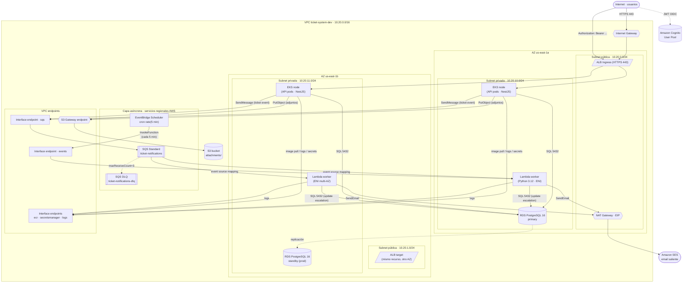
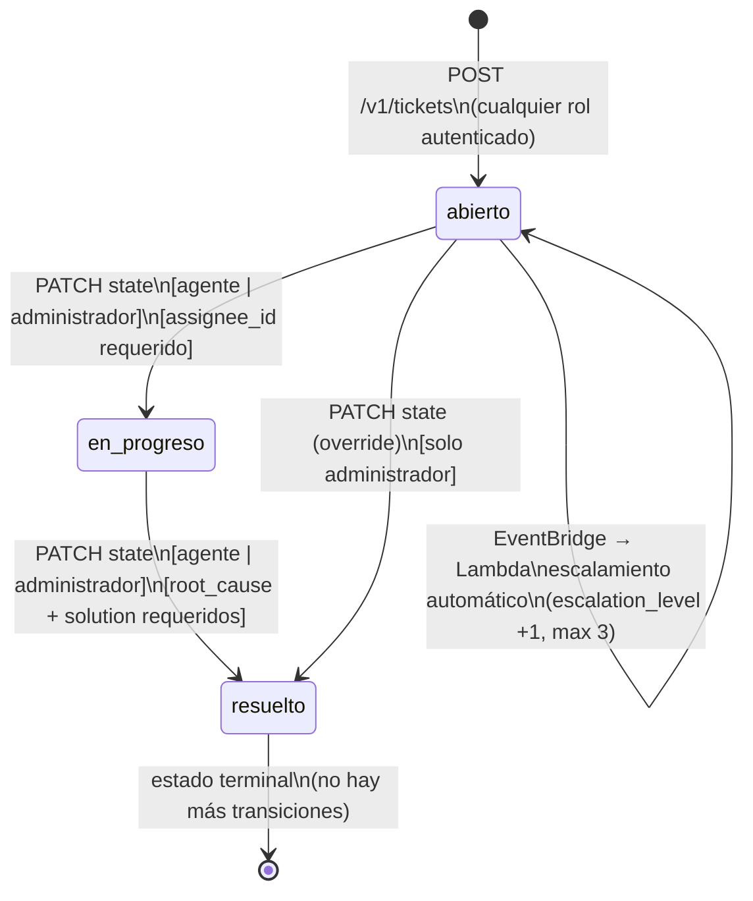

# Sistema de Tickets e Incidentes — Documento del Proyecto
**Universidad Galileo · Postgrado en Diseño y Desarrollo de Software · Infraestructura en la Nube**
**Ciclo Mayo–Junio 2026**

**Equipo:**
- Luis André Morales
- Erick Estuardo Saban

**Versión vigente:** Entrega 5 — Seguridad, Observabilidad y Costos (2026-06-11)

**Historial de versiones:** este es un documento único que evoluciona en cada entrega. Las versiones anteriores quedan inmutables en `git history` bajo los tags `inube-entrega-1` (E1), `inube-entrega-2` (E2), `inube-entrega-3` (E3) e `inube-entrega-4` (E4).

---

## [Versión actual: Entrega 5 — Seguridad, Observabilidad y Costos]
- [x] Resumen de cambios desde E4
- [x] Detalle del componente más complejo (state machine de tickets)
- [x] API surface (endpoints, autenticación, escalado)
- [x] Red detallada (Security Groups por capa, flujo end-to-end)
- [x] Modelo de seguridad (IAM, secretos, KMS, cifrado)
- [x] Plan de observabilidad (logs, métricas RED, alarmas, degradación)
- [x] Estimado de costo mensual
- [x] Riesgos y decisiones pendientes
- [x] Anexo IA (reflexión final)
- [x] Diagrama de contexto (heredado con Cognito confirmado)
- [x] Diagrama de contenedores (heredado de E4)
- [x] Decisión de cómputo (heredada)
- [x] Modelo de datos (heredado)
- [x] Diseño de red (heredado)
- [x] Flujos asíncronos (heredados de E4)
- [x] Preguntas abiertas

---

## Resumen de cambios desde E4

E5 completa el diseño y lo integra. Las decisiones de cómputo (EKS + Lambda), datos (RDS + S3), red (VPC `10.20.0.0/16`, NAT + endpoints) y asíncrono (SQS + EventBridge + SES) no se renegocian. Lo que esta entrega cierra son las preguntas de seguridad y observabilidad que venían abiertas desde E3.

### Cambio 1 — Identity Provider resuelto: Amazon Cognito

E3 y E4 dejaban el IdP marcado como "(por definir)". La decisión es **Amazon Cognito User Pool**. Razón: el código ya lo tenía implícito — el `auth.controller.ts` marca explícitamente `"MOCK hasta EP-14 (Cognito)"` y el backlog tiene `EP-14` reservado para la integración JWKS. Cognito es nativo AWS, no introduce dependencias externas, y su integración con IRSA es directa. El diagrama de contexto se actualiza reemplazando "Identity Provider (E5)" por "Amazon Cognito".

### Cambio 2 — Módulo `security/` documentado formalmente

El módulo `infra/modules/security/` (tres Security Groups tiered + NACLs, implementado en D4 del curso de Automatización) se documenta ahora formalmente en el diseño de E5. La sección §8 — Red detallada consolida las reglas por puerto/origen que el módulo ya provisiona en `main.tf` y `nacl.tf`.

### Cambio 3 — Módulo `observability/` conectado al root

El módulo `infra/modules/observability/` existía desde D4 pero el comentario en su propio `main.tf` decía: "NOTE: this module is intentionally NOT wired into the root module". E5 lo conecta formalmente — tanto en el documento de diseño (§9) como en D5 del curso de Automatización donde se agregarán las alarmas de CloudWatch.

### Cambio 4 — Convención de secretos elevada a diseño formal

El archivo `docs/conventions/secrets.md` contenía la convención de nombres, rotación y KMS acordada durante D4. E5 la incorpora como sección de diseño formal (§7.2 — Modelo de secretos) con la tabla de secretos, dueños y política de rotación.

### Sin cambios

- Decisión de cómputo (EKS + Lambda): sin cambios.
- Modelo de datos (4 tablas RDS + S3): sin cambios.
- Diseño de red (VPC, AZs, subnets, NAT, endpoints): sin cambios.
- Flujos asíncronos (SQS + EventBridge Scheduler + SES): sin cambios.

---

## 1. Diagrama de contexto

El diagrama de contexto (C4 nivel 1) se actualiza en un punto respecto a E4: "Identity Provider (E5)" se reemplaza por **Amazon Cognito User Pool**. Todos los demás actores y sistemas permanecen igual.


**Actores primarios:** Reportante, Agente / SRE, Administrador — los tres interactúan con el sistema vía API REST sobre HTTPS y se autentican contra Cognito User Pool.

**Sistemas externos:**
- **Amazon Cognito User Pool:** emite JWTs firmados con RS256. La API valida cada token contra el JWKS endpoint de Cognito (`https://cognito-idp.{region}.amazonaws.com/{userPoolId}/.well-known/jwks.json`). No hay base de datos de contraseñas propia — Cognito la gestiona.
- **Amazon SES:** destino de notificaciones. Lambda llama `ses:SendEmail` vía SDK; el tráfico sale por el NAT porque SES no tiene VPC endpoint en `us-east-1`.

**Servicios cloud propios:**
- **Amazon S3:** adjuntos de tickets. SSE-S3, versioning, bloque de acceso público, política SSL-only.
- **Amazon RDS PostgreSQL 16:** datos del sistema.

---

## 2. Diagrama de contenedores (heredado de E4)

*(Sin cambios respecto a E4. Se reproduce para que E5 sea autocontenido.)*



---

## 3. Decisión de cómputo

*(Heredado de E3 sin cambios.)*

EKS con managed node group para la API REST síncrona. Lambda (Python 3.12, 128 MB, 30s timeout, dentro de la VPC) para el worker asíncrono. La misma Lambda atiende dos triggers: el event source mapping de SQS (notificaciones) y las invocaciones de EventBridge Scheduler (evaluación de SLA cada 5 min).

---

## 4. Modelo de datos

*(Heredado de E2 sin cambios. Tablas: `tickets`, `ticket_events`, `sla_rules`, `users` en RDS. Adjuntos en S3 bajo `attachments/`.)*

---

## 5. Diseño de red

*(Heredado de E3 con ajuste de E4: se agrega endpoint `events` para EventBridge. Detalle completo en E3 §5. La documentación formal de Security Groups se traslada a §8 de E5.)*

VPC `10.20.0.0/16`, 2 AZs (`us-east-1a`, `us-east-1b`), NAT single-AZ + 6 VPC endpoints (1 gateway S3 + 5 interface: ecr.api, ecr.dkr, secretsmanager, logs, sqs, events).

---

## 6. Flujos asíncronos

*(Heredado de E4 sin cambios. Dos flujos: notificaciones por evento de ticket via SQS → Lambda → SES; evaluación de SLA via EventBridge Scheduler → Lambda → UPDATE en RDS + publicación a SQS. Detalle completo en E4 §6.)*

---

## 7. Detalle del componente más complejo

El componente más complejo del sistema es la **state machine de tickets**, que concentra en un solo objeto la lógica de transiciones de estado, RBAC por transición, cálculo de prioridad, temporización de SLA y el ciclo de escalamiento automático. Es el único componente que cruza todas las capas del sistema: API síncrona, base de datos con optimistic lock, cola SQS asíncrona y el evaluador Lambda periódico.

### 7.1 Estados y transiciones

El ticket tiene tres estados: `abierto`, `en_progreso`, `resuelto`. Las transiciones válidas dependen del rol del actor que las solicita.



**Reglas de transición implementadas en `src/tickets/state-machine.ts`:**

| Transición | Roles permitidos | Condiciones adicionales |
|---|---|---|
| `abierto → en_progreso` | agente, administrador | `assignee_id` debe estar seteado antes o en la misma operación |
| `en_progreso → resuelto` | agente, administrador | `root_cause` y `solution` son campos requeridos en el DTO |
| `abierto → resuelto` (override) | solo administrador | Override registrado como evento `resolucion` en `ticket_events` |
| Cualquier estado → mismo estado | nadie | 409 Conflict — "el ticket ya está en ese estado" |
| Cualquier otra combinación | nadie | 422 Unprocessable — "transición no permitida: X → Y" |

El ticket resuelto es **terminal** — no existe transición de vuelta. Si se necesita reabrir, el diseño actual exige crear un ticket nuevo (decisión documentada como trade-off en §12).

### 7.2 Cálculo de prioridad automática

La prioridad se calcula en el momento de la creación y no cambia durante el ciclo de vida del ticket. La función pura `calculatePriority(severity, impact)` (implementada en `src/tickets/priority.ts`) usa una matriz de suma:

| severity + impact | Prioridad | SLA de resolución |
|---|---|---|
| ≥ 7 (ej. severity=4, impact=3) | `critica` | 60 minutos |
| ≥ 5 | `alta` | 4 horas |
| = 4 | `media` | 24 horas |
| ≤ 3 | `baja` | 72 horas |

Los SLA vienen de la tabla `sla_rules` (sembrada en la migración `0002_sla_seeds`). El campo `sla_due_at` del ticket se calcula al momento de la creación como `NOW() + sla.timeToResolveMinutes`.

### 7.3 Ciclo de escalamiento automático

EventBridge Scheduler invoca la Lambda worker cada 5 minutos. El evaluador usa un **optimistic lock** para evitar doble escalamiento concurrente:

```
┌─────────────────────────────────────────────────────────────────────┐
│  EventBridge Scheduler  →  Lambda worker  (cada 5 minutos)         │
│                                                                     │
│  1. SELECT tickets WHERE state IN ('abierto','en_progreso')         │
│                       AND sla_due_at < NOW()                        │
│                       AND escalation_level < 3                      │
│                                                                     │
│  Para cada ticket vencido:                                          │
│  2. UPDATE tickets                                                  │
│        SET escalation_level = escalation_level + 1,                │
│            sla_due_at = <próximo umbral>                            │
│      WHERE id = :id                                                 │
│        AND escalation_level = :nivel_leído   ← optimistic lock      │
│                                                                     │
│     Si UPDATE afecta 0 filas → otro proceso ya escaló → descartar  │
│                                                                     │
│  3. INSERT ticket_events (event_type='escalamiento', payload=...)   │
│  4. SendMessage a SQS ticket-notifications                          │
│     → flujo de notificaciones notifica a agente + administrador     │
└─────────────────────────────────────────────────────────────────────┘
```

**Niveles de escalamiento:**

| Nivel | Significado | Destinatarios de la notificación |
|---|---|---|
| L1 (escalation_level = 1) | Primer vencimiento de SLA | Agente asignado |
| L2 (escalation_level = 2) | Segundo vencimiento | Agente asignado + Administrador |
| L3 (escalation_level = 3) | Máximo — no escala más | Agente asignado + Administrador + alerta a DLQ si falla |

### 7.4 Idempotencia en la creación

La API acepta un header `Idempotency-Key` en `POST /v1/tickets`. Si el mismo key llega dentro de 24 horas, el sistema devuelve el ticket original con HTTP 200 (sin duplicar). La ventana de 24 horas está implementada en `tickets.service.ts` con un `findFirst` que filtra por `idempotencyKey` y `createdAt > NOW() - 24h`.

### 7.5 Concurrencia y optimistic locking

El campo `version` (integer, default 0) en la tabla `tickets` sirve como optimistic lock para asignación y cambio de estado. El cliente envía el `expectedVersion` en el body; el handler actualiza solo si `version = expectedVersion` y hace `version = version + 1`. Si la condición no se cumple, el handler devuelve 409 Conflict. El ciclo de vida completo de un ticket incrementa `version` de 0 a 3: creación (v0), asignación (v1), inicio de trabajo (v2), resolución (v3).

---

## 8. API surface

### 8.1 Endpoints principales

| Verbo | Recurso | Autenticación | Roles | Códigos de respuesta |
|---|---|---|---|---|
| `POST` | `/v1/auth/login` | ninguna (público) | todos | 200 (token), 401 (credenciales inválidas) |
| `GET` | `/v1/auth/me` | JWT Bearer | todos | 200, 401 |
| `POST` | `/v1/tickets` | JWT Bearer | todos | 201 (creado), 200 (idempotente), 400 (DTO inválido), 422 (prioridad inválida) |
| `GET` | `/v1/tickets` | JWT Bearer | todos | 200 (página), 401 |
| `GET` | `/v1/tickets/:id` | JWT Bearer | todos (reportante: solo los suyos) | 200, 401, 403, 404 |
| `POST` | `/v1/tickets/:id/assign` | JWT Bearer | agente, administrador | 200, 401, 403, 404, 409 (versión) |
| `PATCH` | `/v1/tickets/:id/state` | JWT Bearer | agente, administrador | 200, 401, 403, 404, 409 (estado o versión), 422 (transición inválida) |
| `GET` | `/v1/tickets/:id/events` | JWT Bearer | todos | 200 (cursor paginado), 401, 403, 404 |
| `POST` | `/v1/tickets/:id/comments` | JWT Bearer | todos | 201, 401, 403, 404 |
| `POST` | `/v1/attachments/presign` | JWT Bearer | todos | 200 (URL prefirmada S3), 401 |
| `GET` | `/v1/reports/tickets.csv` | JWT Bearer | administrador | 200 (CSV), 401, 403 |
| `GET` | `/healthz` | ninguna (público) | — | 200 (liveness) |
| `GET` | `/readyz` | ninguna (público) | — | 200 (readiness: BD alcanzable) |

### 8.2 Autenticación

El flujo de autenticación con Cognito (EP-14, pendiente de implementación) funciona así:

1. El cliente llama `POST /v1/auth/login` con email y contraseña. La API delega a Cognito `InitiateAuth`. Cognito valida y emite un `id_token` y `access_token` firmados con RS256.
2. El cliente incluye `Authorization: Bearer <access_token>` en cada request.
3. El guard global `JwtAuthGuard` (NestJS) valida la firma contra el JWKS endpoint público de Cognito. No hay clave compartida entre la API y Cognito — solo el par de claves asimétricas de Cognito.
4. El payload del JWT contiene `sub` (UUID del usuario en Cognito) y el `custom:role` claim que la API mapea a `Role` de Prisma (`reportante`, `agente`, `administrador`).
5. `RolesGuard` lee `request.user.role` (llenado por el guard anterior) y compara contra `@RequireRole(...)` del endpoint.

**Estado actual (E4):** el `auth.controller.ts` emite un JWT mock (`alg: none`) para permitir el desarrollo del frontend sin Cognito. El mock será reemplazado por la integración real en EP-14.

### 8.3 Formato de errores

Todos los errores siguen el estándar **Problem Details (RFC 9457)** implementado en `HttpExceptionFilter`:

```json
{
  "type": "https://httpstatuses.com/409",
  "title": "Conflict",
  "status": 409,
  "detail": "El ticket ya está en estado 'en_progreso'",
  "instance": "/v1/tickets/a3f7c821"
}
```

### 8.4 Estrategia de escalado y throttling

El escalado de la API es horizontal vía EKS: el managed node group puede crecer en número de nodos, y el HPA (Horizontal Pod Autoscaler) de Kubernetes escala los pods dentro del nodo. Para el entorno académico/dev se usa 1 réplica; producción usaría mínimo 2 (una por AZ).

KEDA (`module.keda` en `infra/`) escala el **consumer Deployment** (worker que consume SQS) basado en la profundidad de la cola. Parámetros: `minReplicas=1`, `maxReplicas=5`, trigger cuando hay más de 10 mensajes en la cola.

**Throttling:** no se implementa rate limiting en esta fase. El ALB limita el número de conexiones concurrentes al target group de forma implícita. Si el volumen crece, AWS WAF con reglas de rate-by-IP se agrega en una iteración futura.

---

## 9. Red detallada — Security Groups y flujo end-to-end

### 9.1 Security Groups por capa

El módulo `infra/modules/security/main.tf` provisiona tres Security Groups con reglas SG-to-SG (nunca CIDR para las comunicaciones inter-capa):

**`web-sg` — capa ALB (pública)**

| Dirección | Puerto | Protocolo | Origen/Destino | Descripción |
|---|---|---|---|---|
| Ingress | 80 | TCP | `0.0.0.0/0` | HTTP desde Internet (redirect a 443) |
| Ingress | 443 | TCP | `0.0.0.0/0` | HTTPS desde Internet — TLS termina en el ALB |
| Egress | 3000 | TCP | `app-sg` | ALB reenvía tráfico a los pods EKS |

**`app-sg` — capa EKS nodes (privada)**

| Dirección | Puerto | Protocolo | Origen/Destino | Descripción |
|---|---|---|---|---|
| Ingress | 3000 | TCP | `web-sg` | Tráfico del ALB y health checks |
| Egress | 5432 | TCP | `db-sg` | Conexiones Postgres a RDS |

> El `app-sg` **no tiene egress general** hacia Internet a nivel de SG. El egress de los pods hacia AWS services (ECR, Secrets Manager, logs, SQS, S3) va por los VPC endpoints, y el egress residual (Cognito JWKS, otros dominios externos) sale por el NAT Gateway a nivel de tabla de rutas, no de SG — la tabla de rutas de la subnet privada apunta al NAT como default route.

**`db-sg` — capa RDS (privada)**

| Dirección | Puerto | Protocolo | Origen/Destino | Descripción |
|---|---|---|---|---|
| Ingress | 5432 | TCP | `app-sg` | Postgres solo desde la capa de aplicación |
| Egress | — | — | ninguno | Sin egress — RDS no inicia conexiones salientes |

**`lambda-sg` — Lambda worker (privada)** *(a agregar en D5)*

| Dirección | Puerto | Protocolo | Origen/Destino | Descripción |
|---|---|---|---|---|
| Ingress | — | — | ninguno | Lambda no recibe conexiones entrantes |
| Egress | 5432 | TCP | `db-sg` | Worker consulta y actualiza tickets en RDS |
| Egress | 443 | TCP | VPC CIDR | Acceso a VPC endpoints (SQS, Secrets Manager, logs) |

**`vpce-sg` — VPC interface endpoints (compartido)**

| Dirección | Puerto | Protocolo | Origen/Destino | Descripción |
|---|---|---|---|---|
| Ingress | 443 | TCP | `10.20.0.0/16` | Solo tráfico desde dentro de la VPC |

### 9.2 NACLs

El módulo `infra/modules/security/nacl.tf` agrega una segunda capa de defensa (stateless) sobre los Security Groups:

**NACL pública** (subnets `10.20.0.0/24`, `10.20.1.0/24`): permite ingress en puertos 80 y 443 desde cualquier origen, y egress hacia los puertos efímeros (1024–65535) hacia `0.0.0.0/0`. Todo lo demás se deniega implícitamente.

**NACL privada** (subnets `10.20.10.0/24`, `10.20.11.0/24`): permite ingress desde el CIDR de la VPC en puertos 443, 3000, 5432 y en los efímeros. Deniega ingress directo desde Internet.

### 9.3 Flujo de tráfico end-to-end

```
Usuario (Internet)
    │ HTTPS :443
    ▼
[Internet Gateway]
    │
    ▼
[ALB — subnet pública] ← web-sg (ingress :443 from 0.0.0.0/0, egress :3000 to app-sg)
    │  TLS termina aquí (certificado ACM)
    │  HTTP :3000
    ▼
[EKS node — subnet privada] ← app-sg (ingress :3000 from web-sg, egress :5432 to db-sg)
    │
    ├── JWT validation → Cognito JWKS (salida por NAT, egress general)
    │
    ├── SQL :5432 → [RDS primary — subnet privada] ← db-sg (ingress :5432 from app-sg, sin egress)
    │
    ├── PutObject → [S3 Gateway endpoint] → S3 (nunca sale por NAT)
    │
    └── SendMessage → [SQS Interface endpoint] → SQS ticket-notifications
                              │
                         [event source mapping]
                              │
                    [Lambda worker — subnet privada] ← lambda-sg
                              │
                    ├── SQL :5432 → RDS (por db-sg)
                    └── SendEmail → NAT → SES (no hay VPC endpoint de SES en us-east-1)
```

---

## 10. Modelo de seguridad

### 10.1 Roles IAM por servicio (mínimo privilegio)

Cada componente del sistema tiene un rol IAM con permisos mínimos. Ningún rol usa `AdministratorAccess` ni wildcards `*` en `Action` o `Resource`.

**`ticket-system-{env}-worker-role` — Lambda worker (módulo `compute/`)**

| Acción | Recurso | Propósito |
|---|---|---|
| `logs:CreateLogStream` | ARN específico del log group `/aws/lambda/ticket-system-{env}-worker` | Escribir logs de la función |
| `logs:PutLogEvents` | ARN específico del log group | Escribir logs de la función |
| `s3:ListBucket` | ARN del bucket de adjuntos | Listar objetos para el report generator |
| `s3:PutObject` | `{bucket_arn}/*` | Escribir reportes generados |
| `sqs:ReceiveMessage` | ARN específico de `ticket-notifications` | Consumir mensajes de notificación |
| `sqs:DeleteMessage` | ARN específico de `ticket-notifications` | Confirmar procesamiento |
| `sqs:GetQueueAttributes` | ARN específico de `ticket-notifications` | Métricas de la cola (KEDA) |
| `ses:SendEmail` | `*` (SES no soporta ARN de recurso) | Enviar emails de notificación |

> **Nota sobre `ses:SendEmail`:** SES no permite scoping por ARN de destino en la política IAM. La restricción real se aplica a nivel de SES: solo los emails de dominios verificados pueden ser origen. El destino se controla en la lógica de la aplicación (lista de `recipients` en el payload), no en IAM.

**`ticket-system-{env}-eks-app` — API pods (IRSA, módulo `ingress/iam.tf`)**

| Acción | Recurso | Propósito |
|---|---|---|
| `s3:PutObject` | `{bucket_arn}/*` | Subir adjuntos de tickets |
| `s3:GetObject` | `{bucket_arn}/*` | Descargar adjuntos |
| `s3:ListBucket` | `{bucket_arn}` | Listar adjuntos (endpoint de reportes) |
| `sqs:SendMessage` | ARN específico de `ticket-notifications` | Publicar eventos de ticket |

**`ticket-system-{env}-eks-consumer` — Consumer pods (IRSA, módulo `ingress/iam.tf`)**

| Acción | Recurso | Propósito |
|---|---|---|
| `sqs:ReceiveMessage` | ARN específico de `ticket-notifications` | Polling de mensajes |
| `sqs:DeleteMessage` | ARN específico de `ticket-notifications` | Confirmar procesamiento |
| `sqs:GetQueueAttributes` | ARN específico de `ticket-notifications` | Métricas para KEDA |
| `s3:PutObject` | `{bucket_arn}/*` | Escribir objetos procesados |

**`ticket-system-{env}-scheduler-role` — EventBridge Scheduler (módulo `scheduler/`)**

| Acción | Recurso | Propósito |
|---|---|---|
| `lambda:InvokeFunction` | ARN específico de la Lambda worker | Invocar el evaluador de SLA |

### 10.2 Secretos — modelo de gestión

El sistema gestiona los siguientes secretos en **AWS Secrets Manager**. La convención de nombres es jerárquica: `/ticket-system/{env}/{component}/{purpose}`.

| Secreto | Nombre en Secrets Manager | Dueño | Rotación | Mecanismo |
|---|---|---|---|---|
| Credenciales RDS (usuario + contraseña) | `/ticket-system/{env}/rds/master-credentials` | módulo `database/` | **30 días (automática)** | Lambda de rotación oficial de AWS |
| Clave de firma JWT (servicio worker→API) | `/ticket-system/{env}/api/jwt-signing-key` | módulo `ingress/` | **90 días (automática con solape)** | Rotación con ventana: clave nueva válida en paralelo durante 24h antes de retirar la vieja |
| Cognito Client Secret (cuando EP-14 se active) | `/ticket-system/{env}/api/cognito-client-secret` | módulo `ingress/` (EP-14) | **manual** | Cognito no rota automáticamente — regenerar en la consola y actualizar el secreto |
| Webhook de Slack (extensión futura) | `/ticket-system/{env}/integrations/slack-webhook` | manual | **manual** | El ciclo de vida lo controla Slack |

**Regla de oro:** ningún valor de secreto se commitea al repositorio. Los valores viven en Secrets Manager en runtime, o se inyectan vía `TF_VAR_*` desde el secret store de GitHub Actions solo durante el `terraform apply` de bootstrap. El código solo referencia el ARN o el nombre del secreto.

### 10.3 KMS

**Decisión: clave AWS-managed (`aws/secretsmanager`) por defecto.** No se usa Customer Managed Key (CMK) en la primera iteración. Razón: el módulo `observability/` ya tiene el input `kms_key_arn` preparado (`var.kms_key_arn`, default `null`), pero no hay requerimiento de auditoría de acceso a la clave ni de cross-account access que justifique el costo adicional (~$1/mes por CMK + $0.03 por 10k API calls). Una CMK se agrega cuando haya un requerimiento explícito de rotación de la clave de cifrado independiente del proveedor.

### 10.4 Cifrado en tránsito y en reposo

| Componente | En tránsito | En reposo |
|---|---|---|
| ALB → usuarios | TLS 1.2+ (certificado ACM) | — |
| ALB → pods EKS | HTTP (dentro de la VPC privada — el ALB termina TLS) | — |
| Pods → RDS | `ssl=true` en la connection string de Prisma (`?sslmode=require`) | AES-256 (cifrado de storage RDS habilitado en el módulo `database/`) |
| Pods → S3 | HTTPS (política `DenyInsecureTransport` en el bucket bloquea HTTP) | SSE-S3 (AES-256, habilitado en el módulo `storage/`) |
| Pods → Secrets Manager | HTTPS (via VPC endpoint — interfaz TLS) | AWS-managed KMS |
| Lambda → SES | HTTPS (sale por NAT — TLS obligatorio en el SDK de AWS) | — |
| S3 bucket (adjuntos) | — | SSE-S3 AES-256, versioning habilitado |
| RDS PostgreSQL | — | Storage encryption habilitado (`storage_encrypted = true` en el módulo) |

---

## 11. Plan de observabilidad

### 11.1 Logs estructurados

El módulo `infra/modules/observability/` provisiona dos log groups en CloudWatch con retención configurable por entorno (dev: 7 días, prod: 90 días):

- `/aws/app/ticket-system-{env}/api` — logs de la API NestJS, enviados vía Fluent Bit (container stdout en EKS).
- `/aws/eks/ticket-system-{env}/cluster` — logs del control plane de EKS.
- `/aws/lambda/ticket-system-{env}-worker` — logs del worker Lambda (creado automáticamente por el servicio al primer invocation).

**Formato de log:** la API emite logs JSON estructurados con el interceptor global `LoggingInterceptor` y el middleware `RequestIdMiddleware`. Cada línea de log incluye como mínimo:

```json
{
  "level": "log",
  "timestamp": "2026-06-11T14:32:00.123Z",
  "request_id": "req-a3f7c821",
  "method": "PATCH",
  "path": "/v1/tickets/a3f7c821/state",
  "status": 200,
  "duration_ms": 47,
  "user_id": "usr-1234",
  "role": "agente",
  "ticket_id": "a3f7c821"
}
```

El `request_id` se propaga como header `X-Request-ID` en la respuesta y se incluye en todos los logs de la misma solicitud, lo que permite correlacionar los logs de la API con los eventos de `ticket_events` en RDS y con los mensajes publicados a SQS.

### 11.2 Métricas RED (Rate, Errors, Duration) por servicio

| Servicio | Rate | Errors | Duration |
|---|---|---|---|
| **API (EKS)** | `RequestCount` del ALB target group — requests/min | `HTTPCode_Target_5XX_Count` en el ALB | `TargetResponseTime` del ALB (p50, p95, p99) |
| **Lambda worker** | `Invocations` — invocaciones/5min (EventBridge) + invocaciones por SQS trigger | `Errors` — función retornó error o timeout | `Duration` — p95 del tiempo de ejecución |
| **SQS cola principal** | `NumberOfMessagesSent` — mensajes publicados/min por la API | `ApproximateNumberOfMessagesNotVisible` — mensajes en vuelo (posible stuck) | — (SQS no tiene métrica de latencia nativa; se infiere de `SentTimestamp` en el payload) |
| **SQS DLQ** | `ApproximateNumberOfMessagesVisible` — mensajes en la DLQ | — | — |
| **RDS** | `DatabaseConnections` — conexiones activas | `ReadIOPS`, `WriteIOPS` — operaciones de disco | `ReadLatency`, `WriteLatency` — latencia de I/O |

### 11.3 Alarmas (mínimo 2 definidas)

**Alarma 1 — DLQ con mensajes: acción inmediata**

```
Nombre:    ticket-system-{env}-dlq-messages-alarm
Métrica:   SQS · ApproximateNumberOfMessagesVisible
Namespace: AWS/SQS · QueueName=ticket-notifications-dlq
Threshold: >= 1 mensaje
Período:   5 minutos (1 datapoint)
Acción:    SNS topic → email al equipo de ingeniería
Justificación: cualquier mensaje en la DLQ indica que el worker falló 3 veces
               consecutivas procesando ese mensaje. Requiere investigación inmediata
               para evitar pérdida de notificaciones.
```

**Alarma 2 — Latencia de API elevada: degradación de experiencia**

```
Nombre:    ticket-system-{env}-api-latency-p95-alarm
Métrica:   ALB · TargetResponseTime (p95)
Namespace: AWS/ApplicationELB
Threshold: > 1000 ms (1 segundo) por 3 períodos consecutivos
Período:   1 minuto (3 datapoints consecutivos para evitar falsos positivos)
Acción:    SNS topic → email al equipo de ingeniería
Justificación: p95 > 1s indica que la mayoría de los usuarios experimentan latencia
               inaceptable. El sistema objetivo es p95 < 200ms en operación normal.
```

**Alarma 3 — Errores 5XX en la API: falla de servicio**

```
Nombre:    ticket-system-{env}-api-5xx-alarm
Métrica:   ALB · HTTPCode_Target_5XX_Count
Namespace: AWS/ApplicationELB
Threshold: > 5 errores 5XX en 5 minutos
Período:   5 minutos (1 datapoint)
Acción:    SNS topic → email al equipo de ingeniería
Justificación: más de 5 errores en 5 minutos indica un problema sistémico en la API,
               no errores aislados.
```

### 11.4 Comportamiento ante degradación

El sistema está diseñado para degradar de forma controlada, no colapsar:

**Si falla la base de datos (RDS no alcanzable):**
- El endpoint `/readyz` devuelve 503 (el health check de readiness incluye un `SELECT 1` a la BD).
- El ALB elimina los pods que fallan readiness del target group — el tráfico deja de llegar a esos pods.
- Los pods que ya tenían conexiones activas fallan con 500 y `HttpExceptionFilter` los serializa como Problem Details.
- **Los mensajes de SQS no se procesan** — el Lambda worker intentará reconectar a RDS durante 3 invocaciones y luego los mensajes caen a la DLQ. La alarma 1 dispara.
- **Decisión de diseño:** no hay caché de lectura (decidida en E2 §3.4). Una falla de RDS es una falla del servicio completa para escrituras. Lecturas de attachments desde S3 siguen funcionando si ya tienen URL prefirmada.

**Si falla la Lambda worker (función en error o timeout):**
- Los mensajes de notificación quedan en la cola SQS con visibility timeout activo.
- Después de 3 intentos (`maxReceiveCount=3`), los mensajes van a la DLQ.
- La alarma 1 dispara.
- El servicio de tickets sigue funcionando normalmente — la capa asíncrona es desacoplada. Los usuarios no reciben notificaciones hasta que el worker se recupere, pero pueden seguir creando y resolviendo tickets.

**Si falla el EventBridge Scheduler:**
- Los tickets vencidos no se escalan automáticamente en ese ciclo (cada 5 minutos).
- No hay mecanismo de reintento propio de EventBridge para un ciclo fallido — el próximo tick (5 minutos después) ejecuta de nuevo. El evaluador es idempotente: si un ticket ya fue escalado, el optimistic lock lo descarta.
- Impacto: hasta 5 minutos de retraso en la detección de SLA vencidos. Aceptable para el dominio.

---

## 12. Estimado de costo mensual

**Escenario:** entorno `dev` académico. Cluster EKS mínimo (1 nodo `t3.medium`), 1 instancia RDS `db.t3.micro` sin multi-AZ, ~50 tickets/día, ~200 notificaciones/día.

**Supuestos de uso explícitos:**
- EKS: 1 nodo `t3.medium` corriendo 730 horas/mes (24/7).
- RDS: `db.t3.micro`, 20 GB storage, single-AZ (dev), sin IOPS adicionales.
- Lambda: 2 triggers por tipo de invocación — SQS (~200 invocaciones/día) y EventBridge Scheduler (288 invocaciones/día = 1 cada 5 min × 60 min × 24h). Total: ~488 invocaciones/día × 30 días = ~14,640 invocaciones/mes. Duración promedio 2s, 128 MB.
- SQS: ~200 mensajes/día × 30 = 6,000 mensajes/mes. Primero 1M mensajes/mes son gratuitos (Standard queue).
- SES: ~200 emails/día × 30 = 6,000 emails/mes.
- Cognito: hasta 50,000 MAU son gratuitos en el free tier.
- ALB: 1 ALB activo, tráfico mínimo (~1 LCU/hora).

| Componente | Servicio AWS | Costo estimado/mes |
|---|---|---|
| Control plane EKS | `$0.10/h × 730h` | **$73.00** |
| Nodo EKS (`t3.medium` on-demand, us-east-1) | `$0.0416/h × 730h` | **$30.37** |
| RDS `db.t3.micro` single-AZ | `$0.017/h × 730h` | **$12.41** |
| RDS storage 20 GB `gp2` | `$0.115/GB × 20GB` | **$2.30** |
| NAT Gateway (fijo) | `~$32.85/mes` | **$32.85** |
| NAT Gateway (tráfico egress ~10 GB) | `$0.045/GB × 10GB` | **$0.45** |
| VPC Interface endpoints (5 × 2 AZs = 10 ENIs) | `$0.01/h × 10 × 730h` | **$73.00** |
| S3 storage (adjuntos, ~1 GB) | `$0.023/GB × 1GB` | **$0.02** |
| ALB (fijo + ~1 LCU) | `~$16.20/mes` | **$16.20** |
| Lambda invocaciones (14,640/mes, 128 MB, 2s) | dentro del free tier (1M invoc/mes + 400,000 GB-s) | **$0.00** |
| SQS (6,000 msgs/mes) | dentro del free tier (1M msgs/mes) | **$0.00** |
| SES (6,000 emails/mes) | `$0.10 por 1,000 emails × 6` | **$0.60** |
| CloudWatch Logs (ingesta ~5 GB/mes) | `$0.50/GB × 5GB` | **$2.50** |
| CloudWatch Alarmas (3 alarmas) | `$0.10/alarma × 3` | **$0.30** |
| Cognito (≤50k MAU) | free tier | **$0.00** |
| EventBridge Scheduler (14,400 invocaciones/mes) | `$1.00 por 1M invocaciones` | **$0.01** |
| ECR (almacenamiento de imágenes, ~2 GB) | `$0.10/GB × 2GB` | **$0.20** |
| | **Total mensual estimado** | **~$244/mes** |

**Observaciones:**
- El ítem más caro es el control plane de EKS ($73/mes), que es fijo independientemente del tráfico. En producción, este costo se amortiza con múltiples servicios en el cluster.
- Los VPC interface endpoints ($73/mes) son el segundo ítem más caro. En un entorno de producción con alto tráfico a ECR y logs, se justifican plenamente (el break-even con NAT egress está alrededor de 150 GB/mes de logs, alcanzable en prod).
- Lambda, SQS y Cognito caben en el free tier del escenario académico.
- Para un entorno de producción real (multi-AZ RDS, 3 nodos EKS `t3.large`, 500 tickets/día), el estimado sería aproximadamente **$600–$800/mes**.

---

## 13. Riesgos y decisiones pendientes

### 13.1 Riesgos técnicos

| Riesgo | Probabilidad | Impacto | Mitigación |
|---|---|---|---|
| Cold start de Lambda en VPC > 5s cuando hay burst repentino | Media | Bajo (notificaciones son asíncronas — 5s de delay es aceptable) | Lambda mantiene instancias cálidas con el tráfico regular de EventBridge cada 5 min |
| Duplicados de email si el worker falla después de `ses:SendEmail` pero antes de registrar `notification_sent` | Baja (requiere falla en ventana exacta) | Bajo (usuario recibe hasta 3 emails duplicados antes de DLQ) | Documentado y aceptado en E4 §6.4. Solución perfecta requeriría two-phase commit |
| Escalamiento de SLA incorrecto si dos instancias Lambda corren simultáneamente | Baja | Medio | El optimistic lock en el UPDATE previene el doble escalamiento |
| RDS single-AZ en dev causa indisponibilidad durante mantenimientos AWS | Alta (en dev, AWS puede reiniciar la instancia) | Bajo (entorno académico) | `db_multi_az = true` en `prod.tfvars`. En dev se acepta la indisponibilidad |
| Cognito JWKS endpoint no alcanzable (Cognito degradado) | Muy baja | Alto (100% de requests fallan autenticación) | Sin mitigación en esta fase. Caché local del JWKS es una mejora futura |

### 13.2 Decisiones que revisaríamos con más tiempo

- **Tickets reabribles:** la state machine actual no permite reabrir un ticket resuelto. En un sistema de producción real, los SREs necesitan reabrir tickets cuando la solución no funciona. La decisión de diseño actual (crear ticket nuevo) pierde el historial de la resolución anterior.
- **Autenticación Cognito completa (EP-14):** el sistema opera con JWT mock (`alg: none`) en E4. La implementación de Cognito real es la deuda técnica más crítica antes de un deploy en producción.
- **WAF en el ALB:** el ALB actual no tiene AWS WAF. Un sistema de tickets con información de incidentes de producción es un target válido para ataques. WAF agrega ~$5/mes de costo fijo pero protege contra SQLi, XSS y rate-based rules.
- **VPC Flow Logs:** se evaluó en E3 y se difirió. En producción, los Flow Logs son imprescindibles para auditoría y análisis forense. El costo ($0.50/GB ingestado) se justifica en producción real.
- **NAT Gateway single-AZ a per-AZ:** el NAT actual está solo en `us-east-1a`. Una falla de esa AZ interrumpe el egress de las subnets de `us-east-1b`. Cambiar a NAT per-AZ cuesta ~$33/mes adicional pero elimina ese single point of failure.
- **Endpoint `kms` y `sts`:** diferidos en E3. Si se agrega CMK o IRSA-based token exchange, estos endpoints se necesitan. Con el diseño actual (AWS-managed KMS, IRSA via OIDC federation) no son necesarios.

---

## 14. Preguntas abiertas

E5 cierra todas las preguntas de seguridad y observabilidad planteadas en E3 y E4.

**Cerradas en E5:**
- ✅ Identity Provider → **Amazon Cognito** (§8.2). Integración real en EP-14.
- ✅ Secretos → **AWS Secrets Manager** con naming `/ticket-system/{env}/{component}/{purpose}` (§10.2).
- ✅ Rotación de credenciales RDS → **30 días automática** con Lambda de rotación oficial (§10.2).
- ✅ KMS → **AWS-managed key** por defecto; CMK diferido hasta requerimiento explícito (§10.3).
- ✅ Alarma sobre DLQ → definida en §11.3 (Alarma 1).
- ✅ Métricas RED para Lambda → definidas en §11.2.
- ✅ VPC Flow Logs → diferidos a producción, decisión justificada en §13.2.
- ✅ Endpoints `kms`, `sts`, `ssm` → no necesarios con el diseño actual (§13.2).

**Pendientes (fuera del scope del curso):**
- Implementación real de Cognito (EP-14 en el backlog).
- Tickets reabribles (decisión de producto, no de infraestructura).
- WAF en el ALB (mejora de seguridad documentada en §13.2).

---

## 15. Anexo IA — Reflexión final sobre el uso de IA en el proyecto

### Uso de IA en E5

**Qué le pedimos a la IA en E5:**
- Borrador de la tabla de roles IAM por servicio, con acciones concretas por componente y justificación de cada permiso.
- Estructura de la sección de observabilidad: qué métricas RED corresponden a cada servicio y cómo se define un threshold razonable para las alarmas.
- Ayuda para calcular el estimado de costo usando los precios de us-east-1 de la calculadora de AWS.
- Borrador del diagrama de state machine de tickets en Mermaid.
- Revisión de consistencia entre las decisiones de E5 y el código real del repositorio (iam.tf, security/main.tf, observability/main.tf, secrets.md).

**Qué aceptamos y editamos:**
- **La tabla de roles IAM fue generada por IA con acciones genéricas y editada para reflejar las acciones reales del código.** Por ejemplo, la IA propuso `sqs:*` como acción para el worker — el equipo lo redujo a las tres acciones concretas que el código usa (`ReceiveMessage`, `DeleteMessage`, `GetQueueAttributes`), alineando el documento con lo que `infra/modules/ingress/iam.tf` ya provisiona.
- **La sección de degradación (§11.4) fue estructurada por IA** como lista de escenarios genéricos. El equipo reescribió cada escenario para que describiera el comportamiento concreto del sistema (el health check de `/readyz`, el efecto en el ALB target group, el comportamiento de la DLQ) en lugar de comportamientos hipotéticos.
- **El estimado de costo fue calculado con precios verificados** contra la calculadora de AWS (`https://calculator.aws/pricing/2/calculator`). La IA dio el esquema de la tabla; los números fueron verificados ítem por ítem. El error más común fue el de los interface endpoints: la IA los calculó como 5 × $7/mes en lugar de 5 servicios × 2 AZs × $7.30 = $73/mes — el equipo corrigió el error igual que en E3.
- **El diagrama de state machine fue iterado dos veces.** La primera versión incluía un estado "cancelado" que no existe en el código real (`TicketStatus` no tiene ese valor). Se eliminó para que el diagrama sea fiel a la implementación.

**Qué descartamos y por qué:**
- **AWS Config + Security Hub.** La IA lo propuso como parte del modelo de seguridad. Descartado: agrega complejidad operativa y costo fijo (~$2/mes + $0.001 por regla evaluada) sin beneficio tangible en el contexto académico. Se documenta como mejora futura.
- **Datadog / New Relic como capa de observabilidad.** La IA sugirió reemplazar CloudWatch con una herramienta de observabilidad de terceros. Descartado: la rúbrica pide CloudWatch específicamente, y agregar una herramienta externa introduce un secreto adicional (API key) y egress de logs fuera de la VPC sin VPC endpoint disponible.
- **Tokens de corta duración para Cognito con rotación cada 15 minutos.** La IA lo propuso como "best practice". Descartado: los access tokens de Cognito expiran en 1 hora por defecto, que es razonable para el dominio. 15 minutos requiere que el frontend refresque el token con mucha frecuencia, lo que complica el UX sin beneficio de seguridad material para este sistema.
- **Subnet dedicada para base de datos (`database-only` tier).** La IA lo recomendó de nuevo en E5 (igual que en E3). Se reitera el descarte: la separación mediante `db-sg` (ingress solo desde `app-sg`, sin egress) logra el aislamiento requerido. Un tercer tier de subnets requeriría renumerar CIDRs o usar el headroom del offset `+10` diseñado en E3, pero el beneficio de seguridad adicional es marginal cuando los SGs ya aplican el principio de mínimo privilegio a nivel de capa de red.

### Reflexión sobre el uso de IA a lo largo del proyecto (E1–E5)

**Dónde fue más útil:**
La IA fue más útil en las etapas donde el equipo sabía exactamente qué necesitaba pero no tenía el borrador: tablas de comparación de costos (E3, E5), esquemas de payload JSON (E4), y diagramas Mermaid de primera iteración. En esos casos, la IA ahorraba 30–60 minutos de trabajo de formato, y el equipo podía enfocarse en revisar la correctitud técnica.

**Dónde fue menos útil (o activamente riesgosa):**
La IA fue problemática cuando el equipo la usó para generar decisiones de diseño sin anclarlas al código real. El ejemplo más claro ocurrió en E4: la IA propuso un patrón de notificaciones donde el worker consultaba la BD para resolver destinatarios. El equipo lo descartó porque eso acoplaba el worker a la lógica de RBAC — una decisión que solo se puede tomar si se entiende la separación de responsabilidades del sistema. Otro caso: en E5, la IA calculó mal el costo de los VPC endpoints (el mismo error que en E3, sin recordar la corrección anterior). La IA no tiene memoria entre entregas; el equipo sí.

**Qué aprendimos sobre colaborar con IA en un proyecto de diseño:**
El patrón que funcionó fue: *la IA genera la estructura, el equipo verifica contra el código real*. Cada vez que el equipo omitió la verificación y confió directamente en el output de la IA, introdujo algo que no reflejaba la implementación real (el estado "cancelado" en la state machine, el costo incorrecto de endpoints, las acciones IAM con wildcards). El código es la fuente de verdad — el documento de diseño debe describir lo que el código hace, no lo que la IA cree que debería hacer.
