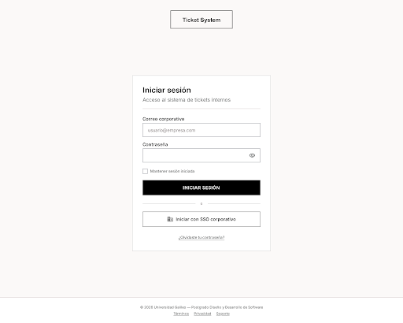
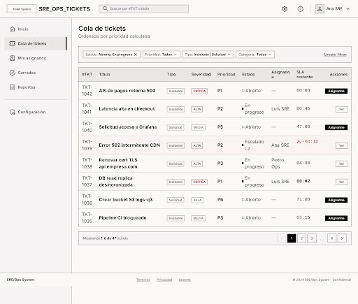
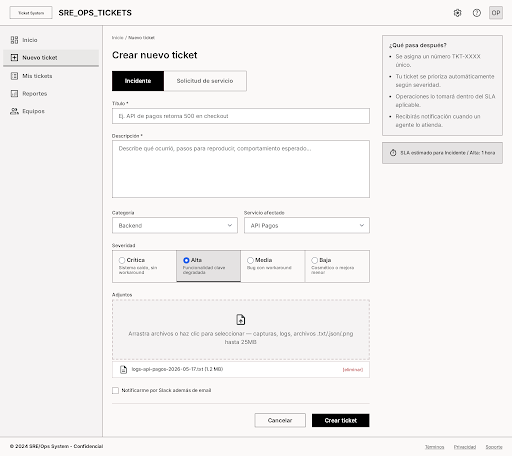
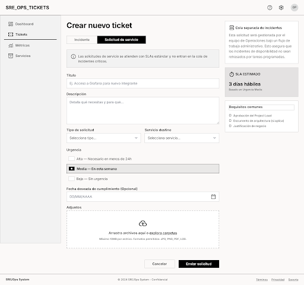
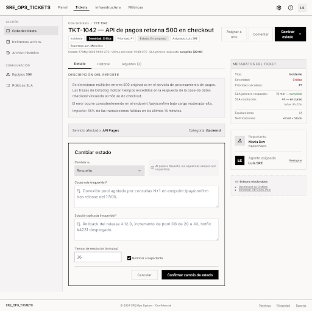
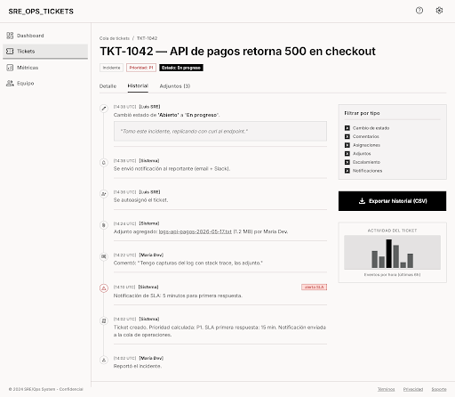
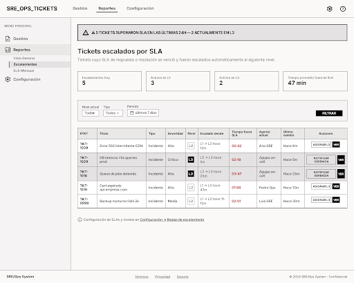
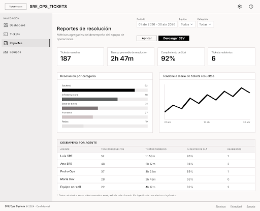

# Mockups Low-Fi — Sistema de Tickets e Incidentes (Entrega #1)

**Universidad Galileo · Postgrado en Diseño y Desarrollo de Software · Infraestructura en la Nube**
**Ciclo Mayo–Junio 2026**

**Equipo:**
- Luis André Morales
- Erick Estuardo Saban

---

## Propósito

Esta carpeta contiene los **8 mockups de baja fidelidad** del frontend del Sistema de Tickets e Incidentes, requeridos por la Entrega #1 (ver [`../E1_TicketSystem.md`](../E1_TicketSystem.md)). Los mockups cubren los **8 casos de uso priorizados** (4 P0, 2 P1, 2 P2) definidos en ese documento.

Los mockups fueron generados con IA usando el **MCP de Stitch** (Google), en modo *Text-to-UI* sobre un design system propio en escala de grises (estilo *Minimalist Blueprint* — herramienta interna de SRE/Ops) y son **editables**: pueden regenerarse o modificarse posteriormente.

- **Proyecto Stitch:** `Ticket System - Low-fi Mockups (E1)` — `projectId: 15601200170054092770`
- **Estilo:** wireframe low-fi, paleta grayscale, bordes 1px, tipografía Inter, UI en español.
- **Dispositivo objetivo:** desktop (la herramienta es interna para SRE, Ops y administradores y requiere alta densidad de datos).

---

## Mapeo Mockup ↔ Caso de Uso

| # | Mockup | Caso(s) de Uso | Prioridad | Actor principal |
|---|---|---|---|---|
| 1 | Login / Autenticación | Soporte transversal a RBAC (§4.7) | — | Todos los roles |
| 2 | Cola de tickets con filtros | CU-02 · Clasificar y asignar · CU-06 · Filtrar y buscar | P0 / P1 | Agente / SRE |
| 3 | Crear ticket — Incidente | CU-01 · Abrir un ticket de incidente | P0 | Reportante |
| 4 | Crear ticket — Solicitud de servicio | CU-08 · Abrir una solicitud de servicio | P2 | Reportante |
| 5 | Detalle de ticket + registrar resolución | CU-03 · Actualizar estado y registrar resolución | P0 | Agente / SRE |
| 6 | Historial / timeline del ticket | CU-05 · Consultar historial y trazabilidad | P1 | Reportante y Agente |
| 7 | Tickets escalados por SLA | CU-04 · Escalamiento automático por SLA vencido | P0 | Administrador / Agente |
| 8 | Reportes de resolución por período | CU-07 · Consultar reporte de resolución por período | P2 | Administrador |

---

## Pantallas

### 1. Login / Autenticación

Pantalla de entrada al sistema. Soporta autenticación con correo corporativo + contraseña y SSO corporativo (Identity Provider externo, §2 Actores de soporte). El rol del usuario se extrae del token y habilita el RBAC del resto del sistema (§4.7).

---

### 2. Cola de tickets con filtros — CU-02 + CU-06

Vista principal del Agente / SRE: tabla densa con la cola **ya priorizada automáticamente** según severidad y tipo (§4.2). Incluye filtros combinados por estado, prioridad, tipo, categoría y agente asignado (CU-06). Cada fila muestra el tiempo de SLA restante; las filas con SLA vencido se marcan visualmente. Acción inline "Asignarme" para CU-02.

---

### 3. Crear ticket — Incidente — CU-01

Formulario que exige clasificar el ticket por **tipo** e **severidad** (§4.1) — `Incidente` activo. Incluye categoría, servicio afectado, descripción, adjuntos drag-and-drop (capturas, logs) y preferencia de notificación. El panel lateral derecho explica qué pasa después: número TKT-XXXX, priorización automática y SLA aplicable.

---

### 4. Crear ticket — Solicitud de servicio — CU-08

Variante del formulario con la pestaña **Solicitud de servicio** activa. Cambian: tipos específicos de solicitud (acceso, configuración, capacidad, credenciales), el bloque "Urgencia" reemplaza a "Severidad", se agrega *fecha deseada de cumplimiento*. Banner informativo aclara que esta cola es **separada de los incidentes críticos**, alineado con el criterio de CU-08.

---

### 5. Detalle de ticket + registrar resolución — CU-03

Vista del Agente para resolver un ticket. Cabecera con `TKT-1042`, badges de severidad/prioridad/estado, tabs Detalle / Historial / Adjuntos. El bloque destacado "Cambiar estado" exige causa raíz y solución aplicada como **campos requeridos al pasar a Resuelto** (criterio de éxito de CU-03). Panel derecho con metadatos: SLA primera respuesta cumplido, SLA resolución en curso, nivel de escalamiento.

---

### 6. Historial / timeline del ticket — CU-05

Timeline cronológico inmutable (§4.4) con cada evento del ticket: creación, asignación, comentarios, cambios de estado, adjuntos, notificaciones de SLA, escalamientos. Cada evento muestra autor, timestamp UTC y descripción. Filtros laterales por tipo de evento y botón "Exportar historial (CSV)" para auditoría.

---

### 7. Tickets escalados por SLA — CU-04

Vista de administrador para monitorear el **escalamiento automático L1 → L2 → L3** (§4.3). Banner de alerta con tickets que superaron SLA en 24h, KPI cards de escalamientos activos por nivel, tabla densa con tiempo fuera de SLA, nivel actual y agente. Filas en L3 destacadas. Acciones por fila: "Asignar L3" o "Notificar gerencia".

---

### 8. Reportes de resolución por período — CU-07

Dashboard del administrador para evaluar desempeño del equipo. Filtros por periodo, equipo y categoría. KPI cards (tickets resueltos, tiempo promedio de resolución, % SLA, reabiertos), gráfico horizontal de resolución por categoría, gráfico de tendencia diaria, tabla densa de desempeño por agente. Botón **Descargar CSV** según el criterio de éxito de CU-07.

---

## Regeneración y edición

Para regenerar o editar las pantallas:

1. Abrir Stitch (`https://stitch.withgoogle.com`) y entrar al proyecto **Ticket System - Low-fi Mockups (E1)** (`projectId: 15601200170054092770`).
2. Para editar vía MCP: usar `mcp__stitch__edit_screens` con el `projectId` y los IDs de pantalla, o `mcp__stitch__generate_screen_from_text` para añadir variantes.
3. Re-descargar el thumbnail PNG desde el campo `screenshot.downloadUrl` que devuelve `mcp__stitch__get_screen`, sobreescribiendo el archivo correspondiente en esta carpeta.

## Notas

- Las imágenes son los thumbnails PNG provistos por Stitch (ancho ~512 px). La versión vectorial (HTML/SVG) se conserva en el proyecto Stitch y puede exportarse en mayor resolución si la entrega lo requiere.
- El estilo low-fi es intencional: la consigna pide *mockups low-fi que pueden generarse con IA y editarse después*. No representan el look final del producto.
