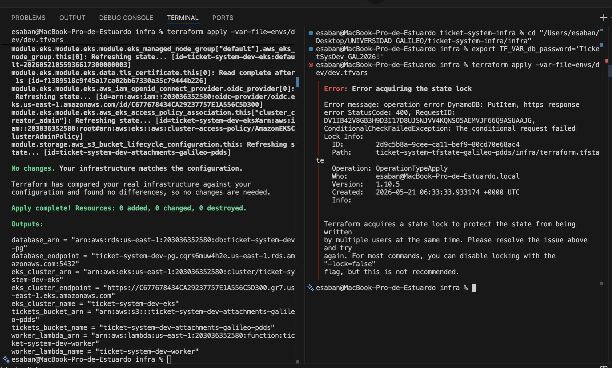
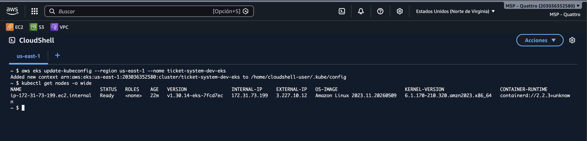

# ticket-system — Infraestructura Terraform

Sistema de tickets e incidentes · Universidad Galileo · Postgrado PDDS · Mayo–Junio 2026

---

## Requisitos

| Herramienta | Versión mínima |
|---|---|
| Terraform | 1.8.x |
| AWS CLI | 2.x |
| Git | 2.x |

---

## Credenciales de AWS

Las credenciales **nunca se hardcodean** en archivos `.tf` ni en el repositorio.

### Opción A — Variables de entorno (local)

```bash
export AWS_ACCESS_KEY_ID="AKIA..."
export AWS_SECRET_ACCESS_KEY="..."
export AWS_REGION="us-east-1"
```

### Opción B — AWS CLI profile

```bash
aws configure --profile ticket-system-dev
export AWS_PROFILE=ticket-system-dev
```

En el pipeline de CI las credenciales se inyectan como **GitHub Actions Encrypted Secrets** (`AWS_ACCESS_KEY_ID`, `AWS_SECRET_ACCESS_KEY`, `AWS_REGION`). Ver sección de CI más abajo.

### Password de la base de datos — `TF_VAR_db_password`

A partir de Delivery 2, el módulo `database` (RDS PostgreSQL) requiere una variable `db_password` marcada `sensitive = true`. **NUNCA** se commitea a `.tfvars` ni a `.tf`.

Inyectarla vía variable de entorno antes de correr Terraform localmente:

```bash
export TF_VAR_db_password='<password fuerte de ≥12 chars>'
terraform plan  -var-file=envs/dev/dev.tfvars
terraform apply -var-file=envs/dev/dev.tfvars
```

En CI, está configurada como GitHub Encrypted Secret `TF_VAR_DB_PASSWORD`.

---

## Bootstrap del backend remoto (run-once)

El workspace `infra/bootstrap/` provisiona el bucket S3 y la tabla DynamoDB que respaldan el remote state del workspace principal. Se ejecuta **una sola vez** por proyecto:

```bash
cd infra/bootstrap
terraform init
terraform apply
terraform output       # state_bucket_name, lock_table_name, region
```

Los outputs ya están en `infra/envs/dev/backend-dev.hcl`. Si los cambias, actualiza el `.hcl` y corre `terraform init -migrate-state -backend-config=envs/dev/backend-dev.hcl` en `infra/`.

> **No** agregar backend block a `infra/bootstrap/` — su estado es local intencionalmente (commiteado al repo, excluido del `.gitignore` global).

---

## Inicializar el workspace principal (Delivery 4 — Pattern A)

```bash
cd infra/

# Dev
terraform init -backend-config=envs/dev/backend-dev.hcl

# Staging
terraform init -backend-config=envs/staging/backend-staging.hcl

# Verifica el formato de todos los archivos .tf
terraform fmt -recursive

# Validación estática (sin llamadas a la API)
terraform validate
```

---

## Generar un plan

```bash
# Plan contra el entorno dev
terraform plan -var-file=envs/dev/dev.tfvars -out=tfplan

# Ver el plan en detalle
terraform show tfplan
```

---

## Aplicar cambios

```bash
terraform apply tfplan
```

---

## Destruir recursos

```bash
terraform destroy -var-file=envs/dev/dev.tfvars
```

---

## Estructura del repositorio

```
infra/
├── provider.tf            # Provider AWS + versiones
├── backend.tf             # Partial config (Pattern A, D4)
├── variables.tf           # Variables de entrada
├── outputs.tf             # Outputs expuestos (re-export de módulos)
├── main.tf                # Wiring de módulos
├── envs/
│   ├── dev/
│   │   ├── backend-dev.hcl  # Backend config dev
│   │   └── dev.tfvars       # Valores para desarrollo
│   └── staging/
│       ├── backend-staging.hcl  # Backend config staging
│       └── staging.tfvars   # Valores para staging (≥3 distintos de dev)
├── bootstrap/             # Workspace run-once para crear el backend (D2+)
│   └── terraform.tfstate  # Local + commiteado intencionalmente
├── modules/               # Módulos reutilizables
│   ├── network/           # VPC, subnets, NAT, VPC endpoints
│   ├── security/          # SGs (web/app/db) + NACLs
│   ├── storage/           # S3 con versioning, lifecycle, SSE, SSL-only
│   ├── compute/           # Lambda report-generator en VPC
│   ├── database/          # RDS PostgreSQL
│   ├── registry/          # ECR (API + web)
│   ├── eks/               # EKS cluster
│   ├── alb_controller/    # ALB Controller + IRSA
│   ├── ingress/           # App stack (SA, ConfigMap, Deployment, Service, Ingress)
│   ├── async/             # SQS main + DLQ (D4)
│   ├── scheduler/         # EventBridge Scheduler + IAM role (D4)
│   └── keda/              # KEDA Helm + IRSA + ScaledObject (D4)
├── evidence/              # Artefactos requeridos por el rubric
├── docs/                  # Resúmenes MD de cada Delivery
└── README.md              # Este archivo
.github/
└── workflows/
    ├── terraform-ci.yml       # 3 jobs: fmt / validate / plan
    ├── terraform-apply.yml    # plan-dev → apply-dev → apply-staging
    ├── terraform-destroy.yml  # gated destroy por entorno
    └── terraform-drift.yml    # drift detection diario (cron)
```

---

## CI/CD — GitHub Actions (Delivery 4)

### PR validation (3 status checks para el ruleset)

| Job | Status check | Qué verifica |
|---|---|---|
| `fmt` | `fmt` | `terraform fmt --check -recursive` |
| `validate` | `validate` | `terraform init` + `terraform validate` |
| `plan` | `plan` | Plan real contra AWS + sube artifact + PR comment |

### Apply (promoción de artefacto)

```
push a main → plan-dev → [tfplan artifact] → apply-dev (env: dev, auto)
                                                       ↓
                                             apply-staging (env: staging, revisor: gitcombo)
```

### Secrets requeridos

**A nivel de repositorio** (`Settings → Secrets → Actions`):
- `AWS_ACCESS_KEY_ID`
- `AWS_SECRET_ACCESS_KEY`
- `AWS_REGION` (`us-east-1`)
- `TF_VAR_DB_PASSWORD` (contraseña de dev)

**GitHub Environment `staging`**:
- `STAGING_DB_PASSWORD` (contraseña de staging, distinta de dev)

**GitHub Environments** (crear en UI `Settings → Environments`):
- `dev` — sin revisor, auto-apply
- `staging` — required reviewer: `gitcombo`

---

## Variables de entorno

| Variable | Tipo | Dev | Staging |
|---|---|---|---|
| `environment` | `string` | `"dev"` | `"staging"` |
| `project_name` | `string` | `"ticket-system"` | `"ticket-system"` |
| `region` | `string` | `"us-east-1"` | `"us-east-1"` |
| `db_instance_class` | `string` | `"db.t4g.micro"` | `"db.t4g.small"` |
| `eks_node_max_size` | `number` | `2` | `3` |
| `sqs_message_retention_seconds` | `number` | `345600` | `86400` |
| `keda_max_replica_count` | `number` | `5` | `3` |

---

## Track seleccionado

**Optional Track 1 — Kubernetes / Amazon EKS** (incluyendo **Deliverable F — KEDA, +25 pts**).

EKS + KEDA auto-escala el consumer Deployment basado en profundidad de la cola SQS.
See ADR 0011 para la comparativa con el track Lambda.

---

## Entregables por Delivery

| Delivery | Fecha | Qué agrega |
|---|---|---|
| D1 | 10 may | Workspace + CI pipeline |
| D2 | 21 may | Módulos de cómputo, almacenamiento, BD + EKS + remote state |
| D3 | 7 jun | Capa de red (VPC, subnets, NAT) — reemplaza default VPC placeholder |
| D4 | 21 jun | Infraestructura asíncrona + pipeline CD + KEDA |
| D5 | 25 jun | Seguridad, observabilidad, one-click deployment |

---

## Evidence

Artefactos requeridos por el rubric del Delivery 2 (ver `infra/evidence/README.md` para los comandos de captura):

### Compute deployed — Lambda async worker

Output de `aws lambda get-function` confirmando que la Lambda está `Active`:

```text
$(< infra/evidence/compute-deployed.txt)
```

Archivo: [`infra/evidence/compute-deployed.txt`](./evidence/compute-deployed.txt)

### Remote state lock contention

Screenshot mostrando que un segundo `terraform apply` falla con `Error acquiring the state lock` cuando ya hay otro corriendo:



### EKS — `kubectl get nodes`

Screenshot de `kubectl get nodes -o wide` con al menos un nodo en `STATUS Ready`:



---

## Evidence — Delivery 3 (Networking Layer)

Comandos de captura en [`infra/evidence/capture-delivery-3.sh`](./evidence/capture-delivery-3.sh).
Resumen escrito en [`infra/docs/delivery-3-summary.md`](./docs/delivery-3-summary.md).

> Nota de captura: las evidencias `*.png` de consola se sustituyen aquí por su
> equivalente reproducible vía AWS CLI / `curl` en archivos `*.txt` (más
> verificable que una captura). El endpoint del API de EKS está bloqueado desde
> la red de build, por lo que la evidencia de nodos (F) se tomó vía AWS API en
> lugar de `kubectl`. Todo el stack in-cluster se aplicó vía GitHub Actions
> (`terraform-apply.yml`) desde una red que sí alcanza EKS.

### Deliverable A — Network Foundation (`terraform output`)

VPC, subnets públicas/privadas, NAT Gateway y SGs provisionados por `module.network` (archivo completo: [`network-foundation.txt`](./evidence/network-foundation.txt)):

```text
vpc_id                = "vpc-06883c7ea728434d5"
vpc_cidr              = "10.20.0.0/16"
public_subnet_ids     = ["subnet-03783df4a113bed6f", "subnet-05dff2dabee355dfe"]
private_subnet_ids    = ["subnet-095ba061c360a8e4f", "subnet-01fc32691e4c64e79"]
nat_gateway_ids       = ["nat-0e792b33f49a6ec43"]
nat_public_ips        = ["18.205.146.120"]
ingress_url           = "http://k8s-ticketsy-ticketsy-0187f58f9a-125632820.us-east-1.elb.amazonaws.com"
web/app/db SG ids     = sg-019d0daf1c622a830 / sg-081c3adb0338f8644 / sg-0594086c02bf0a0cd
eks_cluster_sg_id     = "sg-0dd471fb273761ff0"
tickets_bucket_name   = "ticket-system-dev-attachments-galileo-pdds"
```

### Deliverable B — Network Security (Security Groups + NACLs)

Reglas SG-to-SG aplicadas (`web-sg → app-sg → db-sg`); **db-sg no tiene ingress `0.0.0.0/0`** (archivo completo con `terraform state show` + describe + NACLs: [`security-groups-plan.txt`](./evidence/security-groups-plan.txt)):

```text
web-sg (sg-019d…): ingress 80 ← 0.0.0.0/0, 443 ← 0.0.0.0/0;  egress 8080 → app-sg
app-sg (sg-081c…): ingress 8080 ← web-sg (sg-019d…);          egress 5432 → db-sg
db-sg  (sg-0594…): ingress 5432 ← app-sg (sg-081c…);          (sin egress, sin 0.0.0.0/0)
NACLs: nacl-public (acl-0978…) y nacl-private (acl-0b76…) con reglas stateless in/out
```

Captura de consola (opcional): `infra/evidence/security-groups.png`.

### Deliverable C — Public Ingress (ALB)

`curl -v` contra la URL pública del ALB (Ingress → Service ClusterIP → pods). Archivo: [`ingress-curl.txt`](./evidence/ingress-curl.txt):

```text
> GET /healthz HTTP/1.1
> Host: k8s-ticketsy-ticketsy-0187f58f9a-125632820.us-east-1.elb.amazonaws.com
< HTTP/1.1 200 OK
{"status":"ok"}
```

Captura del target group con targets `healthy` (opcional): `infra/evidence/ingress-healthy.png`.

### Deliverable D — End-to-End Connectivity Proof

`GET /v1/tickets` → `200 OK`, datos **leídos de RDS** (fila sembrada por el Job, no hardcodeada). Archivo: [`e2e-get.txt`](./evidence/e2e-get.txt):

```text
< HTTP/1.1 200 OK
[{"id":1,"title":"Seed ticket — Delivery 3 end-to-end connectivity proof",
  "status":"open","priority":"high","createdAt":"2026-06-08T06:14:50.582Z"}]
```

`POST /v1/tickets` → `201 Created`, objeto **escrito en S3**, devuelve la object key. Archivos: [`e2e-post.txt`](./evidence/e2e-post.txt) · [`e2e-storage.txt`](./evidence/e2e-storage.txt):

```text
< HTTP/1.1 201 Created
{"key":"uploads/2026-06-08T06-18-07-400Z-3afb1f0f-7d2d-49ab-ac4e-d52aa913c182.json",
 "bucket":"ticket-system-dev-attachments-galileo-pdds"}

# objeto verificado en el bucket (SSE AES256, 59 bytes):
2026-06-08 00:18:08   59  uploads/2026-06-08T06-18-07-400Z-3afb1f0f-...json
```

Captura del objeto en consola S3 (opcional): `infra/evidence/e2e-storage.png`.

### Deliverable E — CI Pipeline (plan-on-PR + apply-on-merge)

- **plan-on-PR:** PR [#12](https://github.com/gitcombo/ticket-system-infra/pull/12) — el workflow `Terraform CI` corrió y publicó el plan como comentario ([run 27119328956](https://github.com/gitcombo/ticket-system-infra/actions/runs/27119328956)).
- **apply-on-merge:** al hacer merge a `main`, `terraform-apply.yml` aplicó la capa de red + ingress (incluida la instalación in-cluster del ALB Controller y el Ingress).

Captura del comentario de plan (opcional): `infra/evidence/ci-plan.png`.

### Deliverable F — EKS nodes in private subnets

Nodo `Ready` en subred privada, **sin IP pública** (capturado vía AWS API porque el endpoint de EKS está bloqueado desde la red de build). Archivo: [`eks-nodes-d3.txt`](./evidence/eks-nodes-d3.txt):

```text
node group subnets: [subnet-01fc32691e4c64e79, subnet-095ba061c360a8e4f]  (privadas)
node i-0e044fd4ff6d0d9dc  privateIp=10.20.11.81  publicIp=null  az=us-east-1b
```

Captura `kubectl get nodes -o wide` (opcional, desde una red que alcance EKS): `infra/evidence/eks-nodes-d3.png`.

---

## Evidence — Delivery 4

*Tag: `oyd-delivery-4` · Ejecutar `bash infra/evidence/capture-delivery-4.sh` para los archivos `.txt`.*

### Deliverable A — Async Messaging Module

SQS main queue + DLQ con `redrive_policy` y `maxReceiveCount=3`. ARNs expuestos
como outputs y referenciados sin wildcards en las políticas IAM.

Salida de `terraform output` (queue URL, ARN, DLQ): [`async-foundation.txt`](./evidence/async-foundation.txt).

### Deliverable B — Event-Driven Compute (VPC worker track)

Consumer Deployment `ticket-system-consumer` (KEDA-managed) + IRSA dedicado
(`sqs:ReceiveMessage + DeleteMessage + GetQueueAttributes + s3:PutObject`, sin wildcards).
ConfigMap contiene `SQS_QUEUE_URL` poblado por Terraform.

- Extracto del plan mostrando consumer IRSA + Deployment: [`event-source-plan.txt`](./evidence/event-source-plan.txt)
- `kubectl describe deploy ticket-system-consumer` + logs del pod consumiendo: [`event-source.png`](./evidence/event-source.png)

### Deliverable C — Scheduled Jobs

EventBridge Scheduler invoca el Lambda `ticket-system-{env}-worker` (handler
reescrito como report-generator) con un rol IAM dedicado que solo tiene
`lambda:InvokeFunction` sobre el ARN del Lambda (más estrecho que el exec role).

- Consola EventBridge mostrando el schedule y su destino: [`scheduler.png`](./evidence/scheduler.png)
- Extracto del plan mostrando `aws_scheduler_schedule` + IAM role: [`scheduler-plan.txt`](./evidence/scheduler-plan.txt)

### Deliverable D — Full CD Pipeline

**PR validation (3 status checks):**
- `fmt` — format check
- `validate` — init + validate
- `plan` — plan -out=tfplan + artifact upload + PR comment

**Apply (plan-artifact promotion):**
- `apply-dev` descarga `tfplan` y ejecuta `terraform apply tfplan` (env: `dev`, auto)
- `apply-staging` requiere aprobación manual del reviewer (env: `staging`)

- GitHub Environments (dev / staging + reviewer): [`github-environments.png`](./evidence/github-environments.png)
- Apply run dev (artifact download visible): [`ci-apply-dev.png`](./evidence/ci-apply-dev.png)
- Apply run staging (gate + aprobación): [`ci-apply-staging.png`](./evidence/ci-apply-staging.png)
- Destroy workflow_dispatch + input environment: [`ci-destroy.png`](./evidence/ci-destroy.png)
- Drift detection job summary: [`ci-drift.png`](./evidence/ci-drift.png)
- Branch Ruleset en main (3 required checks): [`ruleset-config.png`](./evidence/ruleset-config.png)
- PR bloqueado por check pendiente: [`ruleset-blocked-merge.png`](./evidence/ruleset-blocked-merge.png)

### Deliverable E — End-to-End Async Proof

Flujo completo: `curl → ALB → POST /v1/notifications/enqueue → SQS → consumer pod → S3`.

```bash
# 1. Producer — HTTP 202 + MessageId
curl -X POST http://<alb>/v1/notifications/enqueue \
  -H "Authorization: Bearer <token>" \
  -d '{"event":"ticket_creado","ticketId":"<uuid>"}'
# → {"status":"accepted","messageId":"<sqs-message-uuid>"}
```

- `curl` completo con respuesta 202 + MessageId: [`async-enqueue.txt`](./evidence/async-enqueue.txt)
- `kubectl logs <consumer-pod>` mostrando `message_processed` con el mismo MessageId: [`async-consumer.png`](./evidence/async-consumer.png)
- Consola S3 con el objeto `async/<MessageId>`: [`async-object.png`](./evidence/async-object.png)

### Deliverable F — EKS Async Integration / KEDA (+25 pts)

KEDA `2.15.1` instalado vía Helm en namespace `keda`. ScaledObject apunta al
Deployment `ticket-system-consumer` con trigger `aws-sqs-queue` (`identityOwner=operator`).
KEDA operator IRSA: `sqs:GetQueueAttributes` sobre el queue ARN exacto.

- `kubectl get scaledobject -A` + `kubectl describe`: [`keda-scaled-object.png`](./evidence/keda-scaled-object.png)
- `kubectl get hpa -A` (HPA gestionado por KEDA): [`keda-hpa.png`](./evidence/keda-hpa.png)
- Evidencia CLI combinada: [`keda-evidence.txt`](./evidence/keda-evidence.txt)
